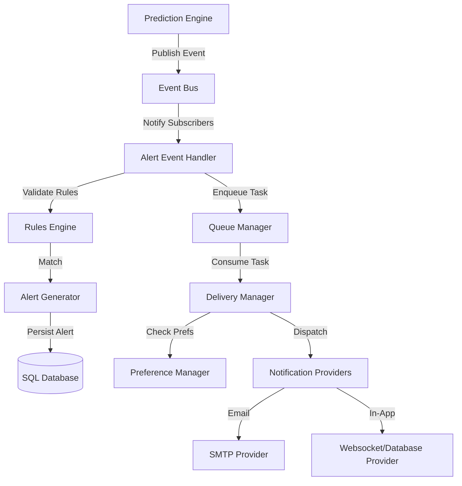

# Phase 2: Alert Architecture Review

This document reviews the architectural layout, system decoupled layers, concurrency models, and reliability parameters designed for the Alert Management System.

---

## 1. Event-Driven Architecture Layout

To isolate execution workloads and prevent external network failures (e.g. SMTP latency) from stalling CNN prediction requests, the system is designed using a publish-subscribe (Pub-Sub) Event-Driven pattern:

### Key Components:
1.  **`event_bus.py`**: A thread-safe, asynchronous in-memory messaging channel (`asyncio.Queue`) for publishing incident events.
2.  **`alert_event_handler.py`**: Listens for event entries, resolves details, and maps delivery workflows.
3.  **`delivery_manager.py`**: Aggregates target recipients, evaluates channel preferences (email, in-app), blocks quiet hours ranges, and schedules delivery.

---

## 2. Decoupling & Modular Design

*   **Logic Decoupling:** The inference logic remains unaware of alert structures. It simply emits a `fire_detected` or `image_processed` message onto the `EventBus`.
*   **State Decoupling:** Users notification preferences are stored independently from primary credentials.
*   **Resource Decoupling:** Delivery providers are abstracted as base classes, allowing developers to add SMS or WhatsApp integrations without changing rule engines.

---

## 3. Reliability & Fault Tolerance Policy

*   **Transactional Durability:** Alerts and notification attempts are persisted in the database (`alerts` and `alert_notifications` tables). Even if a container restarts, pending notifications can be queried and re-dispatched.
*   **Decoupled Queue Retries:** Failed dispatches (e.g. network timeout to email provider) are retried using exponential backoffs, tracking failure counts on each notification record to prevent infinite loop thrashing.
*   **Automatic Escalation:** High-priority alerts verify if dispatchers acknowledge within specified time limits. If no acknowledgement is recorded, the priority manager escalates ownership to administrative lists.
