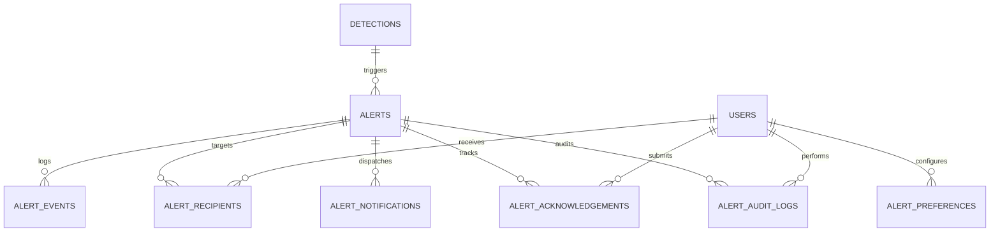

# Phase 3: Alert Data Model Review

This document audits the database tables, indices, constraints, and relationships implemented for the Alert Management System.

---

## 1. Database Table Schema Maps

All database entities extend the primary `BaseModel` class, inheriting UUID primary keys, creation and update trackers, and soft delete fields.

### Table Specifications:

1.  **`alerts`**: Tracks core fire alerts linked to image detection results.
    *   `id`: UUID (PK)
    *   `detection_id`: UUID (FK detections, nullable, SET NULL)
    *   `severity`: String(20) (Critical, High, Medium, Low, Informational)
    *   `status`: String(20) (active, acknowledged, resolved, escalated)
    *   `message`: String(500)
    *   `created_at`, `updated_at`, `deleted_at`
2.  **`alert_events`**: Tracks audit logs of raw triggers and system states.
    *   `id`: UUID (PK)
    *   `alert_id`: UUID (FK alerts, nullable, SET NULL)
    *   `event_type`: String(50) (e.g. `fire_prediction`, `manual_alert`)
    *   `payload`: JSON
    *   `created_at`, `updated_at`, `deleted_at`
3.  **`alert_notifications`**: Tracks actual dispatches and retry parameters.
    *   `id`: UUID (PK)
    *   `alert_id`: UUID (FK alerts, nullable, SET NULL)
    *   `recipient_id`: UUID (FK users, CASCADE)
    *   `channel`: String(20) (email, in_app, sms, whatsapp)
    *   `status`: String(20) (pending, sent, failed)
    *   `sent_at`: DateTime (nullable)
    *   `error_message`: String(500) (nullable)
    *   `retry_count`: Integer
    *   `created_at`, `updated_at`, `deleted_at`
4.  **`alert_recipients`**: Mapping table linking targets to user dispatches.
    *   `id`: UUID (PK)
    *   `alert_id`: UUID (FK alerts, CASCADE)
    *   `user_id`: UUID (FK users, CASCADE)
    *   `created_at`, `updated_at`, `deleted_at`
5.  **`alert_preferences`**: Stores settings per user.
    *   `id`: UUID (PK)
    *   `user_id`: UUID (FK users, CASCADE)
    *   `channel`: String(20) (email, in_app, etc.)
    *   `min_severity`: String(20)
    *   `enabled`: Boolean
    *   `quiet_hours_start`: String(5) (nullable, e.g. "22:00")
    *   `quiet_hours_end`: String(5) (nullable, e.g. "06:00")
    *   `created_at`, `updated_at`, `deleted_at`
6.  **`alert_acknowledgements`**: Tracks incident ownership.
    *   `id`: UUID (PK)
    *   `alert_id`: UUID (FK alerts, CASCADE)
    *   `user_id`: UUID (FK users, CASCADE)
    *   `action`: String(20) (acknowledge, resolve)
    *   `notes`: String(1000) (nullable)
    *   `created_at`, `updated_at`, `deleted_at`
7.  **`alert_audit_logs`**: Telemetry trail of modifications.
    *   `id`: UUID (PK)
    *   `alert_id`: UUID (FK alerts, nullable, SET NULL)
    *   `user_id`: UUID (FK users, nullable, SET NULL)
    *   `action`: String(100) (e.g. `alert_escalated`, `preference_updated`)
    *   `details`: JSON
    *   `created_at`, `updated_at`, `deleted_at`

---

## 2. Optimized Indexes Design

To keep query latencies low under active operational alerts, the database defines the following indexes:

*   `alerts(status, deleted_at)`: Speeds up active dashboard notifications polling.
*   `alert_notifications(recipient_id, status)`: Accelerates pending dispatcher lists retrieval.
*   `alert_preferences(user_id, channel)`: Resolves notification rules checks.
*   `alert_acknowledgements(alert_id, user_id)`: Quick checks on ownership.
*   `alert_audit_logs(alert_id, created_at)`: Decodes historical time lines.
