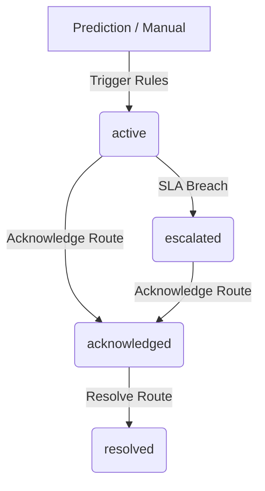

# Alert Management System - Lifecycle Overview

This document guides operators on active fire alert states, priorities, and workflow resolutions.

## 1. Alert Lifecycle States
An emergency alert transitions through the following stages:
1. **active**: Generated automatically by CNN detections or manually by administrators.
2. **acknowledged**: Claimed by a dispatcher/officer who is actively verifying the threat.
3. **resolved**: Closed after verification or fire suppression actions are complete.
4. **escalated**: SLA response duration exceeded; flagged for system administrators.

## 2. Priority SLAs
To prevent dispatcher fatigue while ensuring critical alerts are verified immediately, we enforce Response Service Level Agreements (SLAs):

- **Critical** (Confidence >= 90%): 15 minutes response SLA.
- **High** (Confidence >= 75%): 30 minutes response SLA.
- **Medium** (Confidence >= 60%): 60 minutes response SLA.
- **Low** (Confidence >= 50%): 120 minutes response SLA.
- **Informational**: 24 hours.

If an alert remains in `active` state longer than its SLA, the `EscalationService` automatically shifts its state to `escalated` and broadcasts alerts directly to Admin/Super Admin channels.
