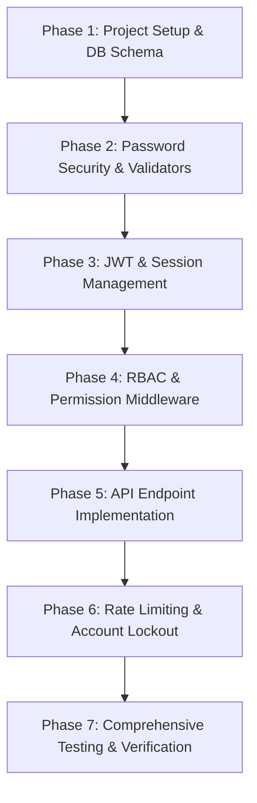

# Authentication & Identity Management Module Audit

## Executive Summary

An audit of the `Forest-Fire-Detection-using-CNN` repository was conducted. The repository was found to be in a clean git-init state, containing only `LICENSE` and `README.md`. As there is no pre-existing backend code, this audit provides a baseline security risk assessment for building a new FastAPI-based authentication system and outlines the architecture needed to avoid typical security pitfalls.

---

## 1. Initial State Assessment & Gap Analysis

Since the repository does not contain an existing codebase, implementing a naive or basic authentication mechanism would introduce significant vulnerabilities. Below are the critical security gaps we must address proactively:

| Area | Potential Risk / Vulnerability | Remediation in Our Architecture |
| :--- | :--- | :--- |
| **Passwords** | Plaintext or weak hashing (e.g. MD5, SHA1) | Password storage using `bcrypt` with adaptive cost factor (minimum 12 rounds). |
| **Tokens** | Hardcoded secrets; long-lived JWTs; no revocation | Dynamic secrets via `.env`; 15-minute access tokens; Refresh Token Rotation (RTR); blacklist. |
| **Authorization** | Missing role/permission validations | Permission-based RBAC with decorator guards, custom exceptions, and hierarchical roles. |
| **Sessions** | No multi-device tracking or session revocation | Session entity tracking user agent, IP, active state, with forced logout capability. |
| **Input Validation**| Missing validations, SQL injection | Strict validation using Pydantic v2 schemas and SQLAlchemy 2.0 type-safe constructs. |
| **Brute Force** | Lack of rate limiting or account lockout | Limit login attempts (lock account after 5 failures) and rate limit `/auth` endpoints. |
| **Logging** | Leakage of PII/secrets in logs; no audit trail | Structured logging with secrets scrubbing; DB-driven security audit logging. |

---

## 2. Hardcoded Secrets Risk

Enterprise systems must avoid committing secret keys (e.g., `JWT_SECRET_KEY`) to version control.
* **Remediation**: Use `pydantic-settings` to load configuration from environment variables. A template `.env.example` will be provided, and `.env` will be added to `.gitignore`.

---

## 3. Prioritized Implementation Roadmap

To build a secure, production-ready Authentication & Identity Management module, we will follow this phased implementation roadmap:

### Milestone 1: Foundation (Phases 1-3)
1. Initialize directory structure and dependencies.
2. Design SQLAlchemy 2.x models with UUID primary keys and soft delete support.
3. Configure config loader and async database connection pool.

### Milestone 2: Security Services (Phases 4-6)
1. Implement Bcrypt hashing and validators.
2. Develop JWT utility with token rotation and revocation.
3. Establish multi-device session management and repository classes.

### Milestone 3: Route Integration & Enforcement (Phases 7-9)
1. Write permission-based RBAC decorators and middleware.
2. Construct `/auth/` endpoints with strict schema validations.
3. Build global exception handling middleware.

### Milestone 4: Operations & Security Review (Phases 10-14)
1. Add rate limiting and brute force countermeasures.
2. Execute test suite (aiming for 90%+ coverage).
3. Produce system documentation.
