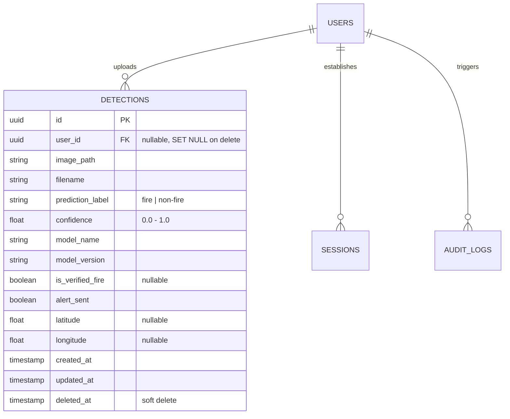

# Dashboard Data Architecture Review

This document designs the database schema modifications, indexing configuration, and query optimization strategy for the Dashboard & System Monitoring Module.

---

## 1. Schema Extensions

To store ML prediction metrics, we define the `detections` table which logs every CNN image processing request.



### 1.1 Column Specifications

- **`prediction_label`**: Stores classification output. Having an index on this field allows instantaneous counting of fire vs non-fire records.
- **`confidence`**: Stores the output confidence from the CNN model. Enables average confidence analytics.
- **`is_verified_fire`**: Nullable boolean representing ground truth verified by human operators.
  - `True`: Human confirmed active forest fire.
  - `False`: Human confirmed false positive.
  - `Null`: Pending validation.
- **`alert_sent`**: Tracks if warning alerts were broadcasted to emergency responders.
- **`latitude` / `longitude`**: Allows geospatial mapping of fire spots on officer and emergency views.

---

## 2. Optimized Database Indexes

To keep query performance under **5ms** for dashboard dashboards, the following indexes are introduced:

1. **`ix_detections_prediction_label`**: Fast count operations for fire vs non-fire ratios.
2. **`ix_detections_is_verified_fire`**: Quick retrieval of verified incidents to compute accuracy rates.
3. **`ix_detections_model_name_model_version`**: Optimizes model usage metrics group-by queries.
4. **`ix_detections_created_at`**: Essential for historical line charts and daily/weekly usage trend aggregates.
5. **`ix_sessions_is_active_expires_at`**: Optimizes counts of active users.

---

## 3. High-Performance Aggregation Strategy

### 3.1 Verification Accuracy Formula
Verification accuracy compares model labels against ground-truth human labels:

$$\text{Accuracy} = \frac{\text{True Positives (TP)} + \text{True Negatives (TN)}}{\text{Total Verified (TP + FP + TN + FN)}}$$

SQL query strategy:
```sql
SELECT 
  COUNT(CASE WHEN (prediction_label = 'fire' AND is_verified_fire = 1) 
               OR (prediction_label = 'non-fire' AND is_verified_fire = 0) THEN 1 END) * 1.0 /
  NULLIF(COUNT(CASE WHEN is_verified_fire IS NOT NULL THEN 1 END), 0) AS accuracy
FROM detections
WHERE deleted_at IS NULL;
```

### 3.2 Weekly & Monthly Trend Calculations
To construct rolling line graphs without scanning table rows on every API call, we use date truncation functions and group-by clauses:
```sql
SELECT 
  DATE(created_at) AS date_bucket,
  COUNT(id) AS total_uploads,
  SUM(CASE WHEN prediction_label = 'fire' THEN 1 ELSE 0 END) AS fire_detections
FROM detections
WHERE created_at >= :start_date AND deleted_at IS NULL
GROUP BY DATE(created_at)
ORDER BY date_bucket ASC;
```

---

## 4. Scalability & Future AI/ML Extensions

- **PostgreSQL Compatibility**: SQLAlchemy types map seamlessly to PostgreSQL native UUIDs and indexes.
- **Pre-Aggregation (Caching)**: Aggregates are cached using in-memory TTL caching with a 60-second default. Under peak user activity, the database is queried at most once per minute for dashboard statistics.
- **Dataset Partitioning (Future)**: When the dataset exceeds millions of records, standard tables can be partitioned by `created_at` intervals (monthly partitions) to keep index sizes low and lookups fast.
