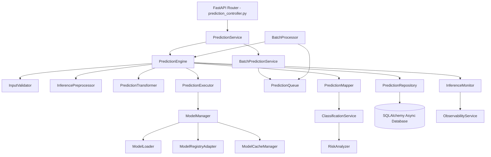

# Phase 2: Inference Architecture Review

This document describes the architecture design, component layers, data flows, and concurrency patterns implemented to fulfill production-ready and enterprise-grade inference requirements.

---

## 1. Architectural Blueprint & Core Design Patterns

The CNN Inference & Prediction Engine uses a multi-layered decoupled design to achieve modularity, maintainability, and clean separation of concerns.

### Key Software Design Patterns:
1. **Singleton & Adapter Pattern:** The `ModelManager` acts as the interface adapter translating requested configurations into live model objects.
2. **Strategy Pattern:** The model architecture loading uses a factory strategy supporting custom CNN, ResNet-18, ResNet-50, MobileNet-V3, and EfficientNet-B0 dynamically.
3. **Producer-Consumer Pattern:** Real-time queue-based batch predictions route tasks to a background thread worker utilizing thread-safe queueing (`PredictionQueue` & `BatchProcessor`).

---

## 2. Component Decoupling

* **Input Validation & Preprocessing:** Handles file integrity checks and resizing without touching deep learning code, keeping GPU threads clear of file I/O operations.
* **Model Manager & Loader:** Isolates PyTorch state dictionary manipulations, CUDA memory allocation, and checkpoint decoding from raw REST API endpoints.
* **Prediction Service & History Manager:** Handles database persistency (`detections` table), audits trail records, and metrics compilation.
* **Batch System:** Implements batch job status tracking and retry fallback strategies without blocking real-time single-image prediction endpoints.

---

## 3. High Availability & Scalability Strategy

* **Graceful CPU Fallback:** If a GPU is present but fails to initialize or experiences a CUDA out-of-memory (OOM) exception, the prediction engine automatically falls back to CPU execution, logging warnings to alert metrics platforms.
* **Hot-Swapping Models:** Models can be loaded into memory and cached under active request loads. Re-registering or updating the target inference model updates the cache reference atomically without needing container restarts.
* **Horizontal Scalability:** The system uses standard database tracking, permitting multiple stateless backend nodes to share database states while caching models locally.

---

## 4. Multi-Model Support & Real-Time Ready

* **Model Registry Adapter:** Enables lookup of PyTorch model metadata and checkpoint files by training run ID, epoch, or specific tags.
* **Extendable Classification & Risk Scoring:** The `RiskAnalyzer` computes risk levels (Low, Medium, High) based on coordinate mapping, classification labels, and prediction confidence thresholds, supporting future integrations with multi-class models (e.g. including a `smoke` class).
