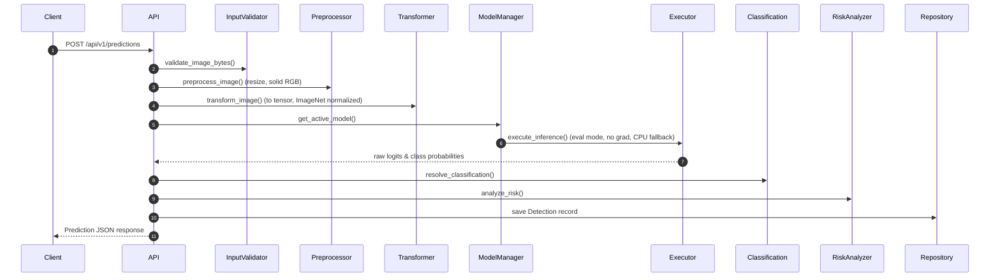

# CNN Inference & Prediction Engine

This module implements the production-ready machine learning inference system for the Forest Fire Detection backend.

---

## 1. Module Overview

The Inference Engine processes uploaded or referenced images, executes deep learning model evaluations using PyTorch ResNet/EfficientNet/Custom CNN architectures, writes prediction audit results to the database (`detections` table), and calculates risk threat level profiles.

---

## 2. Key Directories & Components

All core inference logic is organized inside `backend/app/services/inference/`:

*   **`model_loader.py`**: Loads PyTorch checkpoint parameters and validates state_dict shapes.
*   **`model_manager.py`**: In-memory cache holding active models and routing devices.
*   **`prediction_executor.py`**: Executes the neural network forward pass, enforcing evaluation mode and implementing GPU-to-CPU routing fallback.
*   **`inference_preprocessor.py`**: Handles PIL conversions and Lanczos image scaling.
*   **`prediction_transformer.py`**: normalizes values matching ImageNet parameters.
*   **`classification_service.py` & `risk_analyzer.py`**: Resolves label indexes and sets risk danger zones (Low, Medium, High).
*   **`prediction_queue.py` & `batch_processor.py`**: Implements thread-safe async queue batch processing for drone network feeds.
