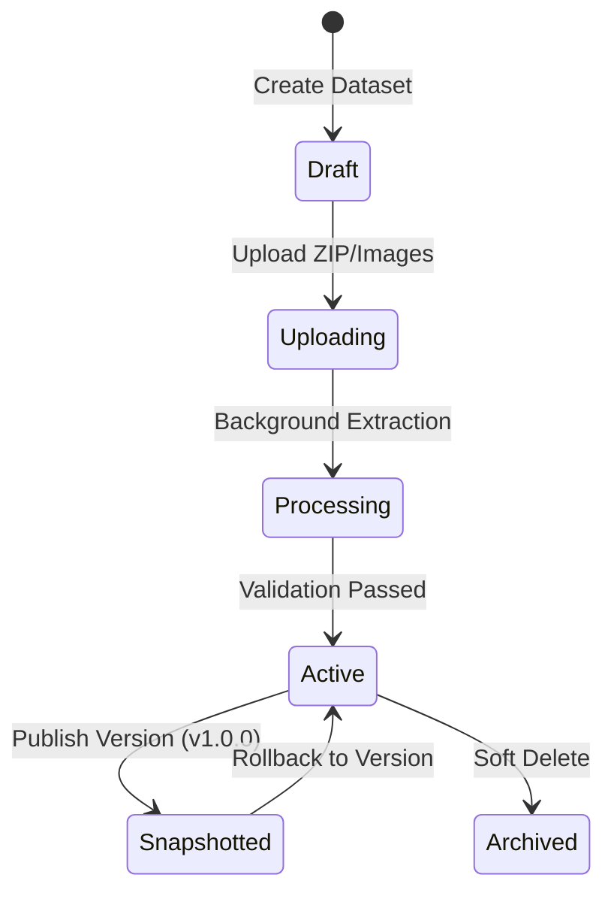

# Dataset Architecture Review (DATASET_ARCHITECTURE_REVIEW.md)

This document reviews the system architecture designed for the Dataset Management Module, focusing on folder layout, version tracking, storage abstraction, and future MLOps compatibility.

---

## 1. Storage & Directory Layout

To support scaling and multi-tenant structures, files are organized in a structured local workspace or cloud prefix pattern:

```
storage/
├── datasets/
│   └── {dataset_id}/
│       ├── raw/                  # Active unversioned file registry
│       │   ├── image_001.jpg
│       │   └── image_002.png
│       └── snapshots/            # Immutable version snapshots
│           ├── v1.0.0.zip
│           └── v1.1.0.zip
└── temp/                         # Staging area for chunk/zip extractions
    └── {upload_id}/
```

### Folder Isolation Policies
- **`raw/`**: Modifiable workspace where active uploads reside. Metadata updates are tracked here before snapshots.
- **`snapshots/`**: Contains final immutable ZIP packages. Once a version is published, its snapshot file is read-only.
- **`temp/`**: Automatically purged by the cleanup daemon after background jobs complete.

---

## 2. Dataset Versioning Lifecycle



1. **Active Files**: Modified via file uploads and label updates.
2. **Version Creation**:
   - Gathers all active dataset files.
   - Saves file metadata (MD5, labels, size) to the database.
   - Compresses the files into a single ZIP archive.
   - Saves the ZIP archive to `snapshots/{dataset_id}/{version_str}.zip`.
3. **Rollback**:
   - Deletes current files in the `raw/` folder.
   - Extracts the version snapshot ZIP back into the `raw/` folder.
   - Restores the dataset database files state to match the snapshotted version files.

---

## 3. Future MLOps Compatibility

Our design prepares this backend to integrate directly with training frameworks (PyTorch, TensorFlow, YOLO) and version control tools (DVC, MLflow):
- **MD5-Based Content Addressing**: File records contain MD5 checksums, enabling DVC-style caching and preventing duplicate downloads.
- **Class Balance Aggregates**: Version metadata tracks image counts per label, allowing training scripts to instantly check label balances without recalculating.
- **Data Export Formats**: Version snapshot endpoints return a standard ZIP format that can be easily loaded by training scripts via automated curl commands.
