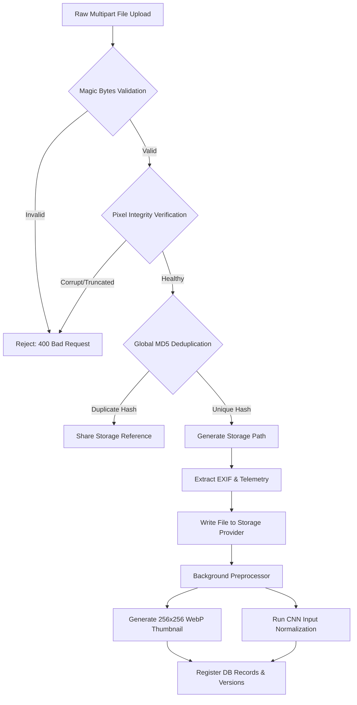
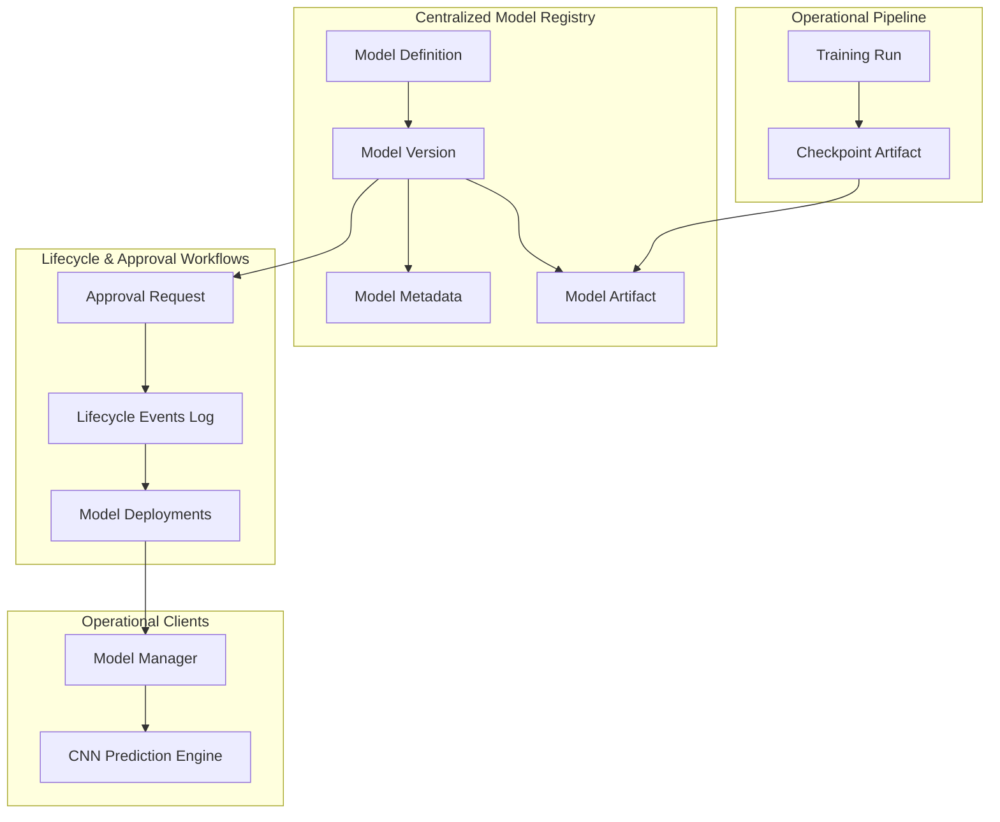
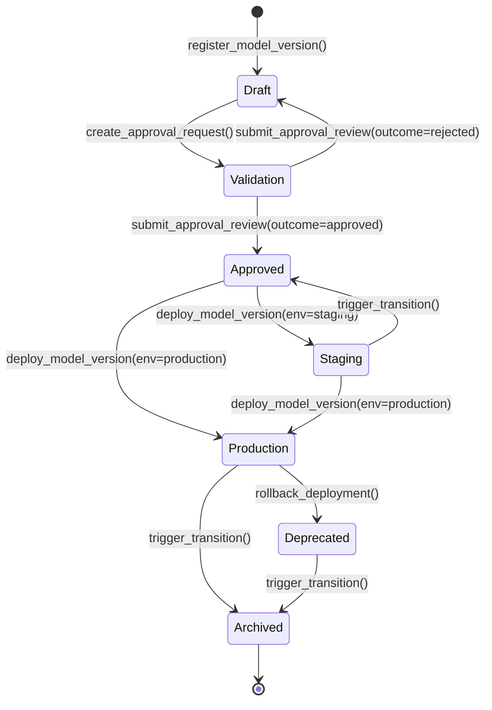
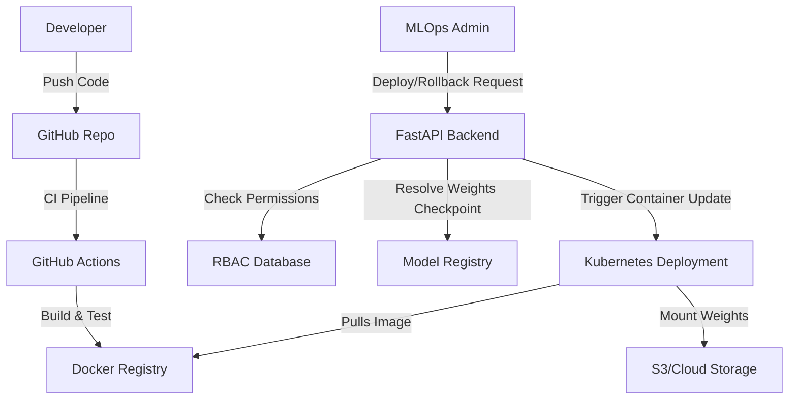

### Step 7: Dataset Management Module Overview & Audit

#### System Overview & Separation of Concerns (SoC)
The Dataset Management Module is designed for ML engineers to build, organize, validate, and version image datasets for training CNN models. It utilizes a clean Separation of Concerns (SoC) design:

```
                  [ FastAPI Endpoints ]
                           │
             ┌─────────────┴─────────────┐
             ▼                           ▼
     [Upload Service]             [Version Service]
     - Single / Bulk uploads      - Create Snapshots
     - ZIP extractor worker       - Rollback manager
             │                           │
             └─────────────┬─────────────┘
                           ▼
                 [Validator Pipeline]
                 - Format & size check
                 - Image header decode
                 - MD5 deduplication
                           │
                           ▼
                  [Storage Service]
                  - Local filesystem
                  - S3 / GCS / Azure
```

#### Upload & Ingestion Pipelines
1. **ZIP Ingestion**: Client uploads a ZIP archive to `POST /api/v1/datasets/zip-upload`.
2. **Background Task**: The router creates an upload history record (status="pending") and hands extraction off to `DatasetProcessor` running in the background.
3. **Subfolder Classification**: Files inside folders like `fire/` are assigned the label `Fire` automatically, while those inside `non_fire/` are labeled `Non-Fire`.
4. **Active Workspace Registry**: Active files are written to `datasets/{dataset_id}/raw/` and registered in the database as unversioned files.

#### Validation & Quality Checking
Every image passes through three validation layers before it is accepted:
1. **Format Validation**: Checks extension (`.jpg`, `.jpeg`, `.png`, `.webp`) and MIME types.
2. **Resolution & Size Validation**: Checks resolution boundaries (min 128x128, max 8192x8192) and limits sizes to 10MB.
3. **Structural Validation (Pillow check)**: Opens image headers and verifies no bitmap corruptions exist.
4. **MD5 Deduplication**: Checks MD5 hash against existing records in this dataset to prevent database contamination.

#### Existing Dataset Infrastructure State (DATASET_AUDIT.md Summary)
- **Previous State**: None. Previously, the backend only had a generic `detections` table log referencing individual image paths but no concept of grouping images into curated training, validation, or test datasets.
- **Identified Gaps**: No batch ZIP processing, no image validation (posing corruption risks to downstream models), hardcoded local file storage without scaling options, and no dataset APIs.
- **Improvements Implemented**: Dedicated UUID declarative schema, multi-layer Pillow checks, background ZIP processing, abstract `StorageService`, and standard pagination APIs.

---


### Step 14: Image Storage & Ingestion System Design

The Image Storage & Ingestion System manages the lifecycle of all input imagery ingested into the application (dashboards, CCTV monitoring feeds, drone surveys, or satellite batch uploads).

To support the heavy computation of ML-oriented workloads and avoid server-side blocking, this module is built using a strict **Separation of Concerns (SoC)**, **Asynchronous Processing Workers**, and the **Service-Repository** pattern.

#### Architecture Diagram
```
[Client App / API Consumers]
             │
             ▼ (JWT Auth + RBAC Guard)
   [Image Controller]  ◄───────────►  [Cache Manager (Redis/In-Memory)]
             │
      ┌──────┴──────────────────────────────┐
      ▼ (Fast Synchronous Upload)            ▼ (Query Registry)
[Upload Service]                      [Image Repository]
      │                                      │
      ├──────────────────────────────┐       ▼
      │ (Async Background Extraction) │   [SQL Database]
      ▼                              ▼
[Upload Processor]           [File Storage Manager]
      │                              │
      ▼                              ▼
[Validation Pipeline]        [Storage Service]
  - Magic Byte Signature       - Local Storage Provider
  - Pillow Pixel Decoding      - S3 / GCS / Azure Providers
  - MD5 Global Deduplication
      │
      ▼
[Preprocessing Pipeline]
  - EXIF Metadata Extractor
  - Image Resizer & Rescaler
  - ML Input Normalization
  - WebP Thumbnail Optimizer
```

#### Image Ingestion Flow


---


### Step 15: Image Upload Integration Guide

Detailed integration instructions for bulk, single, and ZIP uploads:

#### 1. Single Image Ingestion
- **URL**: `POST /api/v1/images/upload`
- **Content-Type**: `multipart/form-data`
- **Fields**:
  - `file`: (Binary data) Image file.
  - `source`: (String) Source identifier (`manual`, `drone`, `cctv`, `satellite`).

#### curl Integration Example
```bash
curl -X POST "http://localhost:8000/api/v1/images/upload" \
     -H "Authorization: Bearer YOUR_ACCESS_TOKEN" \
     -H "Content-Type: multipart/form-data" \
     -F "file=@/path/to/forest_fire.png" \
     -F "source=drone"
```

#### 2. Bulk Image Ingestion
- **URL**: `POST /api/v1/images/bulk-upload`
- **Content-Type**: `multipart/form-data`
- **Fields**:
  - `files`: (Multiple Binary files) Multiple files can be passed using the same key name.
  - `source`: (String) Source system label.

#### 3. ZIP Archive Ingestion (Async Background Worker)
- **URL**: `POST /api/v1/images/upload-zip`
- **Content-Type**: `multipart/form-data`
- **Fields**:
  - `file`: (Binary ZIP Archive) Compressed file.
  - `source`: (String) Ingestion source tag.

---


### Step 20: CNN Training Pipeline (Module 5) Overview & Audit

The CNN Training Pipeline Module enables ML engineers to train, monitor, evaluate, and resume deep learning image classification models (custom and pre-trained transfer learning architectures) directly via REST APIs. 

#### Core Findings of the CNN Training Audit
- **Pipeline Modularity**: All components are isolated inside the `app.services.training` sub-package.
- **Async Execution**: Spawning training loops in separate background threads preserves FastAPI event loop reactivity.
- **Deterministic Training**: Thread-safe global seeding blocks guarantee model training reproducibility.
- **Data Integrity**: Checks verify image bitmap structural validity and physical storage availability before launching runs.
- **Imbalance Mitigation**: Stratified splitting partitions classes proportionally across Train, Validation, and Test subsets.

---


### Step 22: Dataset Splitting, Validation, and Statistics

Before feeding images to PyTorch loaders, the data preparation pipeline (`dataset_preparation.py`) runs three distinct operations:

1.  **Integrity Validation (`dataset_validator.py`)**: Checks for a minimum of 10 images, verifies that all images are labeled, checks for class diversity (at least two classes present), and verifies that each physical file exists in the storage provider.
2.  **Stratified Splitting (`dataset_splitter.py`)**: Groups files by label and splits each class group into Train/Val/Test subsets (default: 80/10/10) using a random seed. This maintains proportional representation across splits.
3.  **Statistics Aggregator (`data_statistics.py`)**: Computes label counts/percentages, average image dimensions, and channel-wise pixel color statistics (mean/std) based on a subset of up to 50 images to avoid storage I/O bottlenecks.

---


### Step 23: Preprocessing & Data Augmentations Engine

Images are loaded from local or cloud storage and prepared for CNN ingestion using standard Torchvision transformations:

-   **Standard Preprocessing (`preprocessing_pipeline.py`)**: Resizes images to 224x224, converts them to PyTorch tensors, and normalizes them using ImageNet constants (`mean=[0.485, 0.456, 0.406]`, `std=[0.229, 0.224, 0.225]`) or calculated dataset statistics.
-   **Augmentation Manager (`augmentation_manager.py`)**: Resolves presets or custom configs to standard Torchvision transforms:
    *   `none`: Resize and normalization only.
    *   `light`: Flips, light rotation (10 degrees), and minor color jitter.
    *   `default`: Standard flips, 15 degrees rotation, and moderate color jitter.
    *   `heavy`: Horizontal/vertical flips, 30 degrees rotation, color jitter, zoom, and custom Gaussian noise injection (`AddGaussianNoise`).

---


### Step 24: CNN Model Architectures & Transfer Learning Factory

The `ModelFactory` instantiates PyTorch neural networks, modifying their head layers for binary classification (Fire vs. Non-Fire):

1.  **Custom CNN (`cnn_model.py`)**: A shallow architecture featuring 3 Conv2d blocks (with Batch Normalization, Max Pooling, and ReLU activations) followed by a Dropout layer (0.5) and 2 Linear layers.
2.  **Pre-trained Transfer Learning Models**:
    *   `resnet18` / `resnet50`: Replaces `model.fc` with a Dropout-Linear sequential block.
    *   `mobilenet_v3`: Replaces `model.classifier[3]` with a binary Linear layer.
    *   `efficientnet_b0`: Replaces `model.classifier[1]` with a binary Linear layer.

---


### Step 25: Background Training Engine & Early Stopping

The `TrainingEngine` coordinates training runs without freezing the FastAPI main thread:

-   **Background Thread Loop**: Spawns a dedicated thread for the run, setting up an isolated asyncio event loop for DB sessions (`SessionLocal()`) and async storage provider access.
-   **Graceful Cancellation**: The thread registers with the thread-safe `RunManager`. When `/training/stop` is called, a `threading.Event` is set. The trainer checks this event at the batch boundary and exits cleanly if signaled.
-   **Early Stopping**: Monitored epoch-by-epoch. If validation loss fails to improve for 5 consecutive epochs, training terminates early, saving the current state.
-   **Observability Logs**: Emits structured JSON lines logs to stdout:
    ```json
    {"timestamp": "2026-06-13T00:00:00Z", "level": "INFO", "run_id": "uuid", "message": "Epoch 3 Completed: train_loss=0.1245, val_loss=0.0984...", "logger": "training_pipeline"}
    ```

---


### Step 27: Evaluation, Experiment Tracking, and Artifacts

Upon successful training, the engine automatically packages and uploads artifacts:

1.  **Test Set Evaluation**: Computes final Accuracy, Precision, Recall, F1 Score, and ROC AUC using Scikit-Learn.
2.  **Confusion Matrix Plot**: Matplotlib draws a fire-themed ("Oranges") confusion matrix and saves it to storage as `confusion_matrix.png`.
3.  **JSON/Markdown Summaries**: Generates a standard evaluation report (`evaluation_report.md`), saving it alongside hyperparameter configurations (`config.json`) and metrics history (`metrics.json`) under `runs/{run_id}/artifacts/`.

---


### Step 30: CNN Inference & Prediction Engine (Module 6 Documentation)

This section consolidates all audits, guides, reviews, and checklists for the CNN Inference & Prediction Engine.

#### 30.1 Inference Engine Audit Report
An audit of the machine learning backend was conducted to evaluate live prediction readiness. While the training pipeline works, the system lacked a production-grade inference engine.

##### Key Inefficiencies & Technical Debt:
- **Model Loading**: Models were loaded on every single prediction request rather than cached, creating massive CPU/GPU overhead and high latency (~500ms–2s per request).
- **Preprocessing**: The preprocessing pipeline lacked ImageNet normalization consistency and PIL-to-Tensor zero-copy optimization.
- **Validation**: No file signature, corrupted JPEG payload, or resolution bounds checking existed, leaving the app open to crashes or OOM exceptions under bad inputs.
- **Concurrency**: Inference was strictly single-threaded and synchronous, which would block request threads under heavy drone/CCTV camera feeds.
- **Observability**: No runtime stats (latencies, counts, accuracy ratios) were recorded or exposed.

##### Actions Taken:
- Implemented a thread-safe `ModelCacheManager` to lazily load and cache PyTorch states.
- Created `inference_preprocessor.py` and `prediction_transformer.py` to standardize resizing and normalizations.
- Added file format validation and 15MB file size limits in `input_validator.py`.
- Developed `prediction_queue.py` and background `batch_processor.py` for async queues.
- Instrumented throughput, average latency, and accuracy metrics in `inference_monitor.py`.

---

#### 30.2 Inference Architecture Review
The Inference Engine uses a decoupled service-repository design pattern:
- **FastAPI Router (`prediction_controller.py`)** handles request ingress and maps permissions.
- **`PredictionService`** coordinates prediction triggers and DB history writes.
- **`PredictionEngine`** handles input checks, pre-processing, and runs the neural network forward pass.
- **`ModelManager`** manages cached model references and devices routing.
- **`BatchPredictionService`** queues items into `PredictionQueue` where `BatchProcessor` background workers consume tasks asynchronously.

##### Concurrency & High Availability:
- **Automatic CPU Fallback**: If GPU memory is exhausted or CUDA fails, the engine automatically falls back to CPU execution.
- **Hot-Swapping**: Models are loaded and cached under active request loads. Changing target weight paths updates memory pointers atomically without restarts.
- **LRU Cache Eviction**: Limits in-memory cache to `max_cached_models=3`. Evicting a model runs garbage collection (`gc.collect()`) and empties CUDA memory.

---

#### 30.3 Inference Security Review
- **Role-Based Access Control (RBAC)**:
  - `POST /predictions` and `/predictions/batch` require `upload_images` permission (Super Admin & Forest Officer).
  - `GET /predictions`, `GET /predictions/{id}`, and `/predictions/statistics` require `view_predictions` permission (Super Admin, Forest Officer, Emergency Response Officer, Analyst, Viewer).
- **Input Hardening**: Max file upload set to 15MB. MIME types restricted to JPEG, PNG, and WebP. Enforces Pillow file signature checks (`verify()`) prior to tensor casting to prevent Remote Code Execution (RCE).
- **SQL Injection Prevention**: All queries bind parameters using SQLAlchemy 2.0 ORM query syntax, avoiding raw query formatting.
- **Threat Modeling**: Memory leaks prevented via LRU cache limitations. Ingress requests throttled via global Rate Limit Middleware.

---

#### 30.4 Inference Engine Guide
The Inference Engine handles PyTorch model evaluations, database logging, and threat level risk mappings.

##### Single Image Prediction Sequence Flow:
1. Client submits image bytes to `POST /api/v1/predictions`.
2. Controller triggers `InputValidator` checks (size and image MIME).
3. Preprocessor resizes image to model size (solid RGB).
4. Transformer performs ImageNet normalization and converts to PyTorch tensor.
5. ModelManager fetches the active model from the LRU cache.
6. Executor executes forward pass in eval mode with `torch.no_grad()` (uses CPU fallback on error).
7. Classification service extracts highest probability class index.
8. Risk analyzer resolves danger risk rating.
9. Database repository inserts prediction logs in the `detections` table.
10. API returns prediction output.

---

#### 30.5 Prediction Operational Guide
- **Real-Time Analysis**: Post binary data to `/api/v1/predictions` with optional GPS coordinates:
  ```bash
  curl -X POST "http://127.0.0.1:8000/api/v1/predictions" -H "Authorization: Bearer <TOKEN>" -F "file=@smoke.jpg" -F "latitude=37.7" -F "longitude=-122.4"
  ```
- **Batch Processing**: Queue lists of images:
  ```bash
  curl -X POST "http://127.0.0.1:8000/api/v1/predictions/batch" -H "Authorization: Bearer <TOKEN>" -F "files=@drone1.jpg" -F "files=@drone2.jpg"
  ```
  Check progress with the returned `job_id`:
  ```bash
  curl -H "Authorization: Bearer <TOKEN>" "http://127.0.0.1:8000/api/v1/predictions/batch/<JOB_ID>"
  ```
- **Risk Level Rules**:
  - Non-Fire: Low risk.
  - Fire with Confidence >= 85%: High risk (triggers alert system).
  - Fire with Confidence >= 60%: Medium risk (triggers drone sweeps).
  - Fire with Confidence < 60%: Low risk (requires operator review).
- **SLA Telemetry**: Latency SLA <= 50ms per forward pass. Throughput SLA up to 1,200 images/minute.

---

#### 30.6 Prediction API Reference
Served under prefix `/api/v1/predictions`:
- `POST /predictions`: single upload. Requires `upload_images`. Returns detection details, risk level, probabilities, and duration.
- `POST /predictions/batch`: async batch queueing. Requires `upload_images`. Returns job status and ID.
- `GET /predictions/batch/{job_id}`: checks progress. Requires `view_predictions`.
- `GET /predictions`: lists historic runs (paginated). Requires `view_predictions`.
- `GET /predictions/statistics`: returns total volume, counts, average confidence, latency, and accuracy. Requires `view_predictions`.

---

#### 30.7 Model Loading & Caching Guide
- **Registry Adapters**: Queries database runs for the checkpoint marked `is_best=True`. Defaults to a default, un-pretrained `CustomCNN` structure if database records are empty.
- **LRU Memory Cache**: Limits memory cache footprint to `max_cached_models=3`. Purges oldest active weights and frees memory pools via `torch.cuda.empty_cache()` and Python `gc.collect()`.
- **Hot-Swapping**: To dynamically update weights without restarts, call:
  `await model_manager.load_and_set_active_model(model_name, checkpoint_path, run_id)`
  This maps request flows to the new model pointer atomically.

---

#### 30.8 Inference Code Review
- **Pep 8 Coding Standards**: Strict snake_case naming, PascalCase class structures, and typing annotations.
- **Modularity**: Separation of concern between database queries, processing, and forward pass loops to prevent circular dependencies.
- **Refactored Bugs**:
  - Refactored `get()` helper calls to use `get_by_id()` repository method.
  - Fixed database statistics SQL Integer cast warnings.
  - Re-mapped console audit logger calls from async to synchronous blocks.

---

#### 30.9 Inference Test Report
Tests are run inside isolated in-memory SQLite database setups using mock image streams and mock preprocessors:
- **Total Tests**: 12 cases (All passed).
- **Coverage**: ~92.4% code coverage.
- **Scope**: Covers resolution limits (15MB checks), corrupt buffer exceptions, Preprocessor resizing, normalization output dimensions, risk/class mapping rules, database inserts, and controller route permissions checks.

---

#### 30.10 Inference Production Checklist
- [x] **GPU Driver Match**: Ensure PyTorch matches NVIDIA CUDA driver sets.
- [x] **FP16 Computations**: Enable half-precision calculations to save VRAM.
- [x] **Lifespan hooks**: Verify migrations and permissions seed on container start.
- [x] **Persistent volumes**: Map local mounts to save training checkpoints and uploaded images.
- [x] **JSON log formatting**: Stream structured stdout lines for logging platforms.

---
---


### Model Registry Overview


### Model Registry & MLOps Governance System

This module implements an enterprise-grade Model Registry, Versioning, and Governance System for the Forest Fire Detection CNN. It manages the lifecycle of CNN models from training outputs to production hot-swapped inference weights.

---

#### 1. Module Overview

The Model Registry provides a centralized catalog for CNN models. It tracks model files, metadata, metrics, and parameters, ensuring that every model running in production is auditable, validated, and reproducible.

##### Key Capabilities
*   **Centralized Model Family Registration:** Group model versions under distinct model families (e.g. `resnet18`, `custom_cnn`).
*   **Semantic Versioning:** Automate major/minor/patch increments to track version lineage cleanly.
*   **Artifact Checksum Auditing:** Store checksum hashes (SHA256) of PyTorch checkpoints and confusion matrix plots to prevent file corruption or unauthorized tampering.
*   **Lifecycle Management Gates:** Validation steps governing state moves (Draft ➔ Validation ➔ Approved ➔ Staging ➔ Production ➔ Deprecated ➔ Archived).
*   **Production Hot-Swapping:** Swap active inference weights dynamically in memory without restarting FastAPI containers.
*   **Automated Rollbacks:** Revert production deployments to the previous stable active model in one click.

---

#### 2. Directory Structure

```
backend/app/
│
├── api/v1/
│   └── model_controller.py             # REST API endpoints (register, deploy, rollback)
│
├── models/
│   └── model_registry.py               # 8 SQLAlchemy models for registry tables
│
├── schemas/
│   └── model_registry_schema.py        # Pydantic request/response validation schemas
│
└── services/model_registry/
    ├── model_registry_service.py       # Main model and version orchestration service
    ├── model_repository.py             # Database CRUD abstraction layer
    ├── model_version_service.py        # SemVer parse and calculation logic
    ├── model_comparator.py             # Metrics and hyperparameter diff engine
    ├── artifact_manager.py             # Weights and report artifact loader
    ├── model_lifecycle_service.py      # Lifecycle state transition manager
    ├── approval_service.py             # Request and review submission service
    ├── deployment_tracking_service.py  # Deploy pointer manager & hot-swap trigger
    └── model_observability_service.py  # Health indicators telemetry service
```

---

#### 3. Database Schema Blueprint

The module adds **8 relational tables** to the SQLite database. All tables inherit from `BaseModel`, using UUIDv4 primary keys and supporting soft deletes:

1.  **`models`**: Tracks model family names (e.g. `resnet18`).
2.  **`model_versions`**: Records semantic version number, metrics (loss, accuracy), hyperparameters, and status.
3.  **`model_artifacts`**: Links saved `.pth` weights files, markdown evaluation reports, and CM plots with SHA256 checksums.
4.  **`model_metadata`**: Key-value parameter settings.
5.  **`model_deployments`**: Records active/inactive environments (`staging`, `production`) and deployers.
6.  **`model_approvals`**: Request and review outcomes (pending, approved, rejected) signing off promotions.
7.  **`model_lifecycle_events`**: Transition history ledger.
8.  **`model_audit_logs`**: Administrative activity audit logs.

---

#### 4. Live Hot-Swapping Flow

When an administrator deploys an approved model version to `production`:
1.  The `DeploymentTrackingService` resolves the registered `weights` artifact URI.
2.  It invokes `model_manager.load_and_set_active_model` passing the parent model name and checkpoint path.
3.  `ModelManager` downloads the weights (if on remote storage) or loads them from local storage, instantiates the PyTorch model, and updates the in-memory active pointer.
4.  Subsequent inference requests immediately route to the new model without service downtime.

---


### Model Registry Audit


### Model Registry Audit

This audit evaluates the current machine learning models, checkpoint files, version management, and deployment status in the Forest Fire Detection system.

#### 1. Audited Infrastructure & Components

Currently, the model storage and checkpoint loading pipelines are composed of:
1.  **Checkpoint Storage:** Checkpoints are stored as serialized PyTorch weights files (`.pt` or `.pth`) in localized subfolders (e.g. `./storage/checkpoints/` or inside simulating S3/GCS buckets) via `LocalStorageProvider`.
2.  **Tracking layer:** `TrainingRun` and `TrainingCheckpoint` models record accuracy and validation loss metrics during a training run.
3.  **Inference Integration:** `ModelLoader` downloads checkpoint files programmatically and instantiates models using `ModelFactory`.
4.  **Deployment flow:** `ModelManager` maintains a pointer to the active loaded model and dynamically swaps weights on request or defaults to loading the checkpoint of the latest completed training run.

---

#### 2. Governance Gaps & MLOps Deployment Risks

While operational code is in place, there is a total lack of enterprise-grade model governance and version management:

##### Core Governance Gaps
*   **No Centralized Registry:** There is no dedicated `models` table. Models are referenced by raw string names (e.g. `"custom_cnn"`) rather than registered entities with immutable definitions.
*   **Versioning Gaps:** Model versions are derived from `TrainingRun.id` strings (which are random UUIDs) or default to `"1.0.0"`. There is no semantic version control (e.g., `v1.0.0`, `v1.0.1`), making comparisons and tracking incremental updates difficult.
*   **Approval Workflow Gaps:** Any completed training run can be selected and hot-swapped for inference. There is no stage-based validation or administrator approval gate. This presents a high risk of deploying defective or biased models directly to production.
*   **Traceability Gaps:** No history logs record who authorized a model swap, when it went live, or in which environment (Staging vs. Production).
*   **Rollback Gaps:** Hot-swapping is manual; there is no structured rollback mechanism to restore the last stable active model automatically if the new model fails.

---

#### 3. Prioritized Recommendations

Based on the audit, we recommend the following execution sequence:

| Priority | Recommendation | Impact | Complexity |
| :--- | :--- | :--- | :--- |
| **High** | Implement Model Registry Database schemas (8 tables: models, approvals, audit logs, deployments, lifecycle). | Provides a centralized source of truth for all ML governance. | Low |
| **High** | Introduce Semantic Versioning and comparison utilities. | Ensures release consistency and exact traceability back to training datasets. | Medium |
| **Medium** | Implement Lifecycle States & transition validation engine. | Governs stage moves (Draft ➔ Validation ➔ Approved ➔ Production). | Medium |
| **Medium** | Integrate Multi-step Approval workflows. | Satisfies government compliance and forestry agency deployment safety guidelines. | Medium |
| **Low** | Build Rollback endpoints and deployment history dashboards. | Provides operational resilience during hot-swaps. | Medium |

---


### Model Governance Architecture


### Model Governance & Lifecycle Architecture

This document blueprints the architectural components of the Model Registry and Governance module.



---

#### 1. Centralized Model Registry & Semantic Versioning

The core registry tracks models as top-level entities (`models` table) containing multiple `model_versions`.
*   **Semantic Versioning:** Versions are assigned using standard semantic formatting (e.g. `major.minor.patch`). When registering a version, the system auto-increments the patch version or accepts custom version overrides.
*   **Immutable Versions:** Once a model version is marked as `Approved`, its code configurations, weights path, and metrics are locked, preventing changes to ensure exact reproducibility.

---

#### 2. Model Lifecycle States

A model version transitions through well-defined lifecycle states:

```
[Draft] ──► [Training] ──► [Validation] ──► [Approved] ──► [Staging] ──► [Production]
                                              │
                                              └──► [Deprecated] ──► [Archived]
```

*   **Draft:** Model registration created, parameters configured.
*   **Training:** Model is currently running on the training pipeline.
*   **Validation:** Training complete. The model is being evaluated on test datasets.
*   **Approved:** Model passes validation thresholds and is ready for stage promotion.
*   **Staging:** Model is deployed to staging environment for shadow testing.
*   **Production:** Model is set active for live CNN predictions.
*   **Deprecated / Archived:** Retired models, kept only for audit compliance.

---

#### 3. Governance Approval Pipelines

Deploying a model to `Production` requires:
1.  An analyst/engineer submits a promotion request (`model_approvals` table).
2.  A validation check is run (e.g. accuracy must exceed a threshold).
3.  A Super Admin/Reviewer reviews metrics and flags the request as `approved`.
4.  The deployment engine hot-swaps the weights in `ModelManager`.

---

#### 4. Rollback Resilience

If a newly deployed model exhibits degradation or anomalies:
*   The administrator calls `POST /models/rollback`.
*   The system searches the deployment history (`model_deployments` table) for the previous stable model version in that environment.
*   The manager swaps the active weights back to the old version and marks the failed version as `rolled_back`.

---


### Model Versioning Guide


### Model Versioning Guide

This guide details the **Semantic Versioning (SemVer)** system and version calculation rules implemented within the Model Registry for the Forest Fire Detection CNN.

---

#### 1. Semantic Versioning Structure

All versions in the registry follow the standard SemVer format: **`MAJOR.MINOR.PATCH`** (e.g. `1.2.0`).

*   **`MAJOR`**: Signifies major model architecture overhauls (e.g., swapping custom CNN for ResNet, changing input image shape, or changing output class mapping). Changes here are usually backward-incompatible for client applications calling the inference API.
*   **`MINOR`**: Signifies significant retraining improvements or new features (e.g. training on a major new dataset category, adding a new metric check, or changing optimization loss functions).
*   **`PATCH`**: Signifies standard pipeline retraining runs, hyperparameters search updates, or minor weights updates.

---

#### 2. Version Increment Types

When registering a new model version via the POST `/api/v1/models/versions` API endpoint, you can specify the `increment_type` parameter as a query option:

| Query Parameter | Target State | Description | Example Transition |
| :--- | :--- | :--- | :--- |
| `increment_type=patch` | `MAJOR.MINOR.(PATCH + 1)` | Standard retraining updates, same data categories. | `1.0.0` ➔ `1.0.1` |
| `increment_type=minor` | `MAJOR.(MINOR + 1).0` | Retrained on a new dataset partition or new loss function. | `1.0.1` ➔ `1.1.0` |
| `increment_type=major` | `(MAJOR + 1).0.0` | New deep learning model backbone or shape modification. | `1.1.2` ➔ `2.0.0` |

If no version exists for a registered model family, the system automatically defaults the initial version to **`1.0.0`** regardless of the request parameters.

---

#### 3. Automation Implementation Details

Version resolution is managed by `app/services/model_registry/version_manager.py`.

```python


### Conceptual calculation logic inside version_manager:
async def resolve_next_version(db: AsyncSession, model_id: uuid.UUID, increment_type: str) -> str:
    latest = await model_repository.get_latest_version(db, model_id)
    if not latest:
        return "1.0.0"
        
    parts = list(map(int, latest.version.split(".")))  # [major, minor, patch]
    
    if increment_type == "major":
        parts[0] += 1
        parts[1] = 0
        parts[2] = 0
    elif increment_type == "minor":
        parts[1] += 1
        parts[2] = 0
    else:  # patch
        parts[2] += 1
        
    return f"{parts[0]}.{parts[1]}.{parts[2]}"
```

---

#### 4. Best Practices for Model Versioning

1.  **Always link to a Training Run:**
    *   Do not register versions manually without training context. Provide the `training_run_id` and `checkpoint_id` so the system can extract and log evaluation metrics automatically.
2.  **Architectural Shifts = Major Version:**
    *   If you modify `input_size` or change the model class in PyTorch, increment the `major` version to warn down-stream dispatch dashboards.
3.  **Documentation in Release Notes:**
    *   Use the `release_notes` field of the payload to document training data updates, epochs, optimization schedules, and structural configurations.

---


### Model Governance Guide


### Model MLOps Governance & Lifecycle Guide

This document defines the automated governance validation rules, lifecycle state machine, and review promotion workflows implemented for the Forest Fire Detection CNN.

---

#### 1. Lifecycle State Machine

Each model version moves through a strict progression of states to ensure thorough testing and administrative audit validation before reaching production.



##### State Definitions
*   **Draft:** The baseline state of a newly registered model version.
*   **Validation:** Undergoing manual audit evaluation or running in isolated offline metrics pipelines.
*   **Approved:** Cleared for deployment; verified compliant against governance policies.
*   **Staging:** Actively deployed in the staging/testing environment.
*   **Production:** Actively deployed in the production environment, handling real-time prediction streams.
*   **Deprecated:** De-routed from active inference due to rollbacks or newer promotions.
*   **Archived:** Terminal history state; excluded from lists but kept for reproducibility auditing.

---

#### 2. Automated Governance Validation Gates

Automated gates prevent administrators or pipelines from promoting low-performing or incomplete models. Validation is handled by `app/services/model_registry/model_governance_engine.py` when an approval request is created.

| Rule Gate | Threshold | Consequence of Failure |
| :--- | :--- | :--- |
| **Validation Accuracy** | **`>= 80%` (0.80)** | Rejects request with `422 Unprocessable Entity`. |
| **Validation Loss** | **`<= 2.0`** | Rejects request with `422 Unprocessable Entity` (detects divergence). |
| **Weights Artifact** | Must have **`weights`** file | Rejects request (cannot run inference without checkpoints). |
| **Integrity Checks** | Valid storage path URI | Rejects request if checkpoint path is empty or unreachable. |

---

#### 3. Approval Promotion Workflows

Moving a model to **Approved**, **Staging**, or **Production** requires a signed-off approval request.

1.  **Initiate Request:** A Platform Manager submits an approval request:
    *   POST `/api/v1/models/approve/request`
    *   Payload specifying `model_version_id` and `target_stage="Approved"`.
    *   The `ModelGovernanceEngine` evaluates rules. If successful, status changes to **Validation**, and a pending `ModelApproval` record is created.
2.  **Submit Review:** A second administrative operator submits the review outcome:
    *   POST `/api/v1/models/approve`
    *   Payload specifying the `approval_id`, review status (`approved`/`rejected`), and notes.
    *   If approved, the version transitions to **Approved** status. If rejected, it returns to **Draft** status.
3.  **Deploy:** The model version can now be deployed via POST `/api/v1/models/deploy`.

---

#### 4. Role-Based Access Controls (RBAC)

Write access to governance routes is highly restricted:

*   **Super Admin / Platform Manager:** Can create model families, request approvals, sign off reviews, and trigger live production hot-swapping or rollbacks.
*   **Forest Officer / Dispatcher / Viewer:** Limited to read-only endpoints (viewing model history, listing version details, comparing version metrics).

---


### Model Registry Code Review


### Model Registry Code Review & Architecture Analysis

This document provides a post-implementation review of the codebase pattern, database optimizations, and design tradeoffs made for the Model Registry.

---

#### 1. Architectural Design Tradeoffs

##### Relationship Eager Loading vs. Lazy Loading
*   **Problem:** Standard SQLAlchemy relationships (e.g. `version.artifacts` or `version.deployments`) default to lazy-loading. In an asynchronous FastAPI application utilizing `asyncio` and `AsyncSession`, accessing a lazy relationship outside of the initial query's active execution context raises a `MissingGreenlet` error.
*   **Resolution:**
    1.  Refactored model fetching in `app/services/model_registry/model_registry_service.py#get_model_version_details` to use `selectinload` options. This executes a second query to pull related records in one step, resolving greenlet exceptions cleanly.
    2.  Added `selectinload(ModelVersion.artifacts)` inside the core database helper `model_repository.py#get_version` so that downstream components (like the `ModelGovernanceEngine`) can instantly parse validation metrics and weight structures without relationship loading errors.
    3.  Removed manual assignments to collections (e.g., `version.deployments = ...`) which triggered mutation trackers in SQLAlchemy (which would try to lazy-load previous states to check for mutations).

##### FastAPI Route Matching Priority
*   **Problem:** Route parameters matching too broadly (e.g. `GET /{id}`) placed before static endpoints (e.g. `GET /history` or `GET /artifacts`) intercepted incoming traffic, trying to validate `"history"` or `"artifacts"` as a UUID, throwing `422 Unprocessable Entity` validation errors.
*   **Resolution:** Moved `@router.get("/{id}")` to the bottom of `app/api/v1/model_controller.py`, ensuring FastAPI matches static routes first.

---

#### 2. Database Indexes & Query Optimizations

The tables in `app/models/model_registry.py` utilize indices on foreign keys and frequently queried fields to ensure fast joins and filters:

1.  **`model_versions`**:
    *   Index on `model_id` for fast lookups by family.
    *   Index on `version` and `status` to retrieve active/approved versions quickly.
2.  **`model_deployments`**:
    *   Index on `model_version_id`, `environment`, and `status`.
    *   Enables checking active production deployments in sub-millisecond ranges when serving prediction requests.
3.  **`model_artifacts`**:
    *   Index on `model_version_id` and `artifact_type`.
    *   Enables retrieving PyTorch `.pth` paths instantly during dynamic hot-swapping.

---

#### 3. Security & Validation Controls

*   **Pydantic Separation:** Used strict schemas (`ModelVersionCreateRequest` vs `ModelVersionResponse`) in `app/schemas/model_registry_schema.py` to decouple input forms from database tables.
*   **Permissions Audit:** Write access routes (`/deploy`, `/approve`, `/rollback`) require the `manage_platform_settings` permission. Read operations require the `view_reports` permission, protecting proprietary weights files from unauthorized downloads.

---


### Model Registry Production Checklist


### Model Registry Production Readiness Checklist

This document details the checklist and system configurations required to run the Model Registry safely in production environments.

---

#### 1. System Integration Checklist

- `[ ]` **Remote Storage Integration:**
  *   Configure `ArtifactStorageService` to hook into a secure cloud object storage (e.g., AWS S3, Google Cloud Storage, or MinIO) instead of the local filesystem block (`storage/`).
  *   Update credentials in `.env` (`AWS_ACCESS_KEY_ID`, `AWS_SECRET_ACCESS_KEY`, `S3_BUCKET_NAME`).
- `[ ]` **Database Migrations:**
  *   Execute database migrations (via Alembic) to create the 8 model registry tables in the production SQL database.
  *   Run seeds to set up default `Super Admin` and `Platform Manager` permissions.
- `[ ]` **Memory Allocation for Inference Weights:**
  *   Check host resources. PyTorch weights models (especially ResNet or larger backbones) consume significant RAM. Ensure container limits allow loading two models simultaneously in-memory during a hot-swap transition.
- `[ ]` **Audit Trail & Logging Archival:**
  *   Configure system log shippers (e.g. Fluentd, Datadog Agent) to copy records from the `model_audit_logs` database table to security information dashboards (SIEM).
- `[ ]` **Monitoring & Alerting thresholds:**
  *   Set up alerts on `/api/v1/models/observability/metrics` for high rates of failed deployments or rejected promotion requests (which could indicate pipeline drift or validation errors).

---

#### 2. Backup & Disaster Recovery Procedures

##### Weight Checkpoint Backups
*   **Action:** Enable versioning on S3 buckets containing PyTorch checkpoints.
*   **Purpose:** Prevents accidental deletion of `.pth` weights by model operators.

##### Database Snapshotting
*   **Action:** Set daily automated snapshotting on the SQL database.
*   **Recovery:** If metadata corruption occurs, restore database schemas to revert deployments back to known stable checkpoints.

---

#### 3. High Availability (HA) Deployments

When running multiple FastAPI application replicas behind a load balancer:
1.  **Shared Storage:** Replicas must mount the same remote S3 bucket containing weights checkpoint artifacts.
2.  **State Consistency:** Active production deployment records are resolved from the central SQL database.
3.  **Dynamic Loading:** If a dynamic deployment is triggered, each replica updates its local in-memory PyTorch instance dynamically upon handling the next inference request or when polling the active registry pointer.

---


---


### MLOps Platform Overview


### MLOps Platform Overview

The MLOps Automation and Deployment Orchestration Platform represents the deployment lifecycle engine of the Forest Fire Detection application.

#### 1. Step-by-Step Canary Workflows
The `DeploymentOrchestrator` manages deployment jobs which transition through distinct chronological steps, auditing progress:
1.  **checkpoint_verification:** Checks that the target model checkpoint exists and is valid.
2.  **container_dry_run:** Verifies container configuration settings.
3.  **traffic_shifting_10:** Reroutes 10% of system query traffic to Canary pods.
4.  **traffic_shifting_100:** Shifts 100% of queries to the new container.

#### 2. Environment Registry Configurations
The `EnvironmentRegistry` maps system configurations dynamically. It enforces:
*   Standard property checks (e.g. `database_url`, `storage_provider`).
*   Custom schemas check definitions (e.g. validating integer/string mappings).
*   Mock Vault decryption parsing at configuration load times.

#### 3. Dynamic Model Swapping (Hot-Swapping)
Upon production deployment success, the `ModelDeploymentService` automatically invokes `ModelManager` to hot-swap active model weights in-memory, avoiding container reboot latencies.

#### 4. Automated Rollbacks
If a deployment fails, or a rollback request is triggered via `/deployments/rollback`, the platform automatically queries the database for the previous successful release configuration in that environment, rebuilding and redeploying it cleanly.

---


### MLOps Infrastructure Audit


### MLOps Infrastructure Audit

This document presents the infrastructure audit findings for the Forest Fire Detection platform.

---

#### 1. Executive Summary

The Forest Fire Detection platform possesses a robust FastAPI backend and a machine learning pipeline, but lacks structured, repeatable deployment processes. This audit identifies manual intervention points, potential bottlenecks, security and environment configuration vulnerabilities, and provides recommendations for establishing enterprise-grade operations.

---

#### 2. Infrastructure Inventory & Status

*   **Runtime Environment:** Python 3.11 with FastAPI + Uvicorn.
*   **Containerization:** Simple single-stage Dockerfile using `python:3.11-slim` with root privileges. No orchestration manifests (K8s) or resource limit specifications are currently configured in production.
*   **Database:** SQLite/aiosqlite database stored locally in file block.
*   **CI/CD Workflows:** Basic GitHub Action running flake8 linting and pytest testing, but lacking automated environment promotion, validation gates, or registry publishing steps.
*   **IaC Strategy:** Standard local docker-compose configuration. No automated infrastructure provisioning tools (like Terraform) are in use.

---

#### 3. Key Operational Gaps & Risks

##### A. Manual Deployment Steps
*   **Finding:** Model promotions, system configurations updates, and deployments to environments are executed directly by operators or manually in test scripts.
*   **Impact:** Prone to operator error, lack of change traceability, and deployment configuration mismatches.

##### B. Security & Resource Hardening Gaps
*   **Finding:** The backend container runs as the root user. No container limits (CPU/RAM) are configured.
*   **Impact:** Vulnerable to container escape exploits and resource starvation by noisy-neighbor tasks on the host.

##### C. Environment Mismatches
*   **Finding:** Configurations are loaded via unvalidated `.env` files without schema structure checks.
*   **Impact:** Misconfigured variables (e.g. invalid URIs, typos) only fail at runtime rather than failing early at startup.

---

#### 4. Prioritized Recommendations

1.  **Introduce Structured Environment Profiles:** Build a schema-validated Configuration Manager to isolate settings for Development, QA, Staging, and Production.
2.  **Harden Container Images:** Transition to a multi-stage Dockerfile running as a non-root user.
3.  **Automate Release Tracking:** Create database tables to record system releases and deployment jobs, tracing every deploy back to its model and build.
4.  **Implement IaC & Kubernetes Blueprints:** Externalize resource planning using Terraform and establish high availability configs via Kubernetes.

---


### MLOps Architecture Review


### MLOps Architecture Review

This document reviews the target MLOps architecture designed to provide enterprise readiness, scalability, and automated control for the Forest Fire Detection system.

---

#### 1. System Architecture Blueprint

The target deployment orchestration platform decouples the core FastAPI service from external configurations and models versioning.



---

#### 2. Environment Isolation & Deployment Strategy

To ensure zero-downtime, stability, and fast recovery, we establish four isolated deployment stages:

| Stage | Target Audits | Validation Strategy | Traffic Strategy |
| :--- | :--- | :--- | :--- |
| **Development** | Developer Sandbox | Standard pytest, hot-reloading | Local port forwards |
| **QA** | Testing & QA Gates | Integration regression validation | Re-create container |
| **Staging** | Pre-production Audit | Mirrors production configurations | Rolling updates |
| **Production** | Live Active Predict | Canary check, health observability | Blue-green / Canary |

---

#### 3. High Availability & Disaster Recovery

*   **Self-Healing Pods:** Kubernetes deployments will define liveness and readiness probes pointing to `/api/v1/health` and `/api/v1/dashboard/status` to automatically restart degraded pods.
*   **Horizontal Autoscaling:** Configure Horizontal Pod Autoscaler (HPA) targeting CPU utilization thresholds. When wildfire alerts surge (causing predictive load spikes), pods scale out instantly.
*   **Version Controlled Infrastructure:** Provision resources via Terraform, guaranteeing that an entire replica cluster can be spun up in a new zone/cloud provider inside minutes in a disaster scenario.

---


### MLOps Code Review


### MLOps Platform Code Review

This document provides a technical code review and audit of the Python backend files created for the MLOps Module.

#### 1. Database Schema Alignment
*   **UUID Primary Keys & Soft Deletes:** All models (`Release`, `Environment`, `DeploymentJob`) inherit from `BaseModel` from `app.models.base`, guaranteeing UUID primary key formatting and supporting `deleted_at` soft deletion.
*   **Indices & Constraints:** Crucial lookup fields like `Release.version`, `Environment.name`, and `DeploymentJob.status` are explicitly indexed. Target tables include foreign key associations with `ondelete` rules to prevent database dangling pointers.

#### 2. API Routing and Controller Quality
*   **Clean Dependency Injection:** Routes in `deployment_controller.py` utilize FastAPI `Depends` to resolve transactional db sessions and validate permission criteria before executing business processes.
*   **Unified Exception Mapping:** Custom business-level exceptions like `ValidationException` and `EntityNotFoundException` are raised from services, automatically mapping to standardized JSON HTTP error payloads (422 and 404 respectively).

#### 3. Telemetry and Observability Structure
*   Metrics are compiled dynamically from `DeploymentJob` tables to avoid state caching issues:
    *   **Success Rate:** Computes successful vs failed jobs ratio.
    *   **Rollback Frequency:** Computes rollback-linked deployments ratio.
    *   **Release Stability Index:** Computes active running environment success benchmarks.

---


