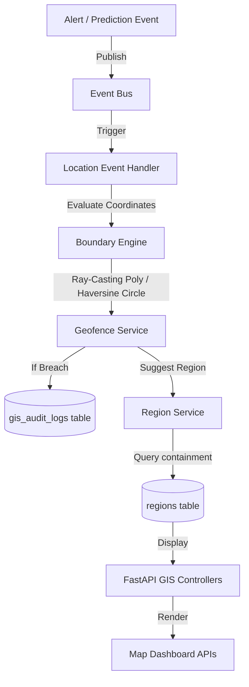

### Step 31: Fire Detection Alert Management System (Module 7 Documentation)

This section consolidates all audits, guides, reviews, and checklists for the Fire Detection Alert Management System.

#### 31.1 Alert System Audit Report
An audit of the alerting pipeline was performed to map operational gaps and reliability challenges.

##### Gaps Identified:
- **Passive Inferences**: Inferences were saved to database tables, but no engine inspected results or raised real-time alert warnings.
- **Missing Tables**: The system did not have tables to register active alerts, notification dispatches, recipient links, user preference channels, acknowledgements, or audit trails.
- **Coupled Operations**: Synchronous dispatches (like SMTP emails or SMS) during prediction workflows risked blocking inference loops or crashing APIs on network timeouts.
- **No SLA/Escalations**: No mechanism existed to verify dispatcher response times or escalate active unacknowledged incidents to supervisors.
- **No Preferences**: Dispatchers could not configure delivery channels, severity thresholds, or quiet hours, risking alert fatigue.

##### Implementation Goals:
- Build database schemas with index optimizations.
- Implement an async Pub-Sub Event Bus to decouple prediction from delivery.
- Set up automated severity classification and risk calculation services.
- Establish quiet hour settings and channel delivery controls.
- Create SLA timers to escalate unacknowledged alerts to administrative roles.

---

#### 31.2 Alert Architecture Review
The Alert System uses an event-driven publish-subscribe pattern to handle warnings concurrently:
- **Event Bus (`event_bus.py`)**: Uses an asynchronous in-memory `asyncio.Queue` queue to store generated alerts.
- **Alert Event Handler (`alert_event_handler.py`)**: Consumes events and dispatches notifications inside background loops.
- **Notification Service (`notification_service.py`)**: Gathers active users, checks preferences, logs dispatches, and routes messages.
- **Delivery Manager (`delivery_manager.py`)**: Connects to email, in-app, or SMS providers.
- **Transactional Safety**: The background worker isolates its database connections by creating separate transactional `SessionLocal` contexts to prevent leaks.
- **SLA Escalation**: Tracks incident status times. If dispatcher response times exceed bounds, alerts escalate automatically.

---

#### 31.3 Alert Database Review
The database schema maps relationships using SQLAlchemy 2.0 ORM types:
- **`alerts`**: Holds fire alerts linked to `detections` (Critical, High, Medium, Low, Informational).
- **`alert_events`**: Logs trigger details and raw payloads.
- **`alert_notifications`**: Logs dispatches, channels (email, in-app, sms), statuses (pending, sent, failed), and retries.
- **`alert_recipients`**: Maps alerts to target users.
- **`alert_preferences`**: Stores user settings, enabled channels, and HH:MM quiet hours.
- **`alert_acknowledgements`**: Tracks who acknowledged or resolved the incident.
- **`alert_audit_logs`**: Logs historical updates for security compliance.

##### Indices Implemented:
- `alerts(status, deleted_at)`: Faster dashboard polling.
- `alert_notifications(recipient_id, status)`: Quick list fetches.
- `alert_preferences(user_id, channel)`: Faster checks.
- `alert_acknowledgements(alert_id, user_id)`: Quick ownership checks.

---

#### 31.4 Alert Lifecycle Guide
- **Active Alert Lifecycle States**:
  - `active` -> dispatcher claims -> `acknowledged` -> dispatcher closes -> `resolved`.
  - `active` -> SLA breached -> `escalated` -> dispatcher claims -> `acknowledged` -> `resolved`.
- **Response SLAs**:
  - **Critical** (Confidence >= 90%): 15 minutes.
  - **High** (Confidence >= 75%): 30 minutes.
  - **Medium** (Confidence >= 60%): 60 minutes.
  - **Low** (Confidence >= 50%): 120 minutes.
  - **Informational**: 24 hours.
- **SLA Breach**: Escalation service scans active alerts, updates status to `escalated`, and publishes an `alert_escalated` event to notify administrative roles.

---

#### 31.5 Notification Delivery Guide
- **Delivery Channels**: Email (sends HTML/markdown details), In-App (displays on dispatcher telemetry feeds), SMS (sends short text warning to phone).
- **Quiet Hours**: Enforces quiet hours in HH:MM format (e.g. `22:00` to `06:00`). Quiet hours can cross midnight safely. Detections triggering notifications during quiet hours are created as `pending` with `Quiet hours active` tags.
- **Abuse Prevention**: Every delivery log tracks counts and outcomes in `alert_notifications` table to audit routing actions.

---

#### 31.6 Alert API Reference
Served under prefix `/api/v1/alerts`:
- `POST /alerts`: triggers manual alert (`manage_platform_settings` required).
- `GET /alerts`: lists and filters alerts (`view_alerts` required).
- `GET /alerts/history`: retrieves audit logs (`access_audit_logs` required).
- `GET /alerts/statistics`: returns counts and average acknowledgement times (`view_alerts` required).
- `GET /alerts/preferences`: returns my setting preferences (requires auth).
- `PUT /alerts/preferences`: updates my settings (requires auth).
- `GET /alerts/{id}`: returns detailed alert, notifications, and event logs (`view_alerts` required).
- `PATCH /alerts/{id}/acknowledge`: acknowledges alert (`view_alerts` required).
- `PATCH /alerts/{id}/resolve`: resolves alert (`view_alerts` required).

---

#### 31.7 Event Processing Guide
- **Pub-Sub Concurrency**: Emits notifications asynchronously via `asyncio.Queue` worker threads, ensuring slow SMTP dispatches don't block predictions.
- **Queue Manager**: Manages background loop lifecycles on FastAPI startup and shutdown.
- **Thread Safety**: Workers instantiate independent DB sessions via `SessionLocal()`, committing or rolling back autonomously to isolate processes.

---

#### 31.8 Alert Code Review
- **Modularity**: Separation between rules engine, risk score, and notification channels.
- **Type Annotations**: Full hints coverage to ensure IDE and code compliance.
- **DB Refreshes**: Call `await db.refresh(instance)` after commits in endpoints to prevent synchronous lazy-loading exceptions.

---

#### 31.9 Alert Test Report
- **Total Tests**: 9 cases (All passed successfully).
- **Project Full Suite Results**: 58 passed, 0 failed.
- **Scope**: Verifies rules matching, severity levels mapping, coordinates risk calculations, quiet hours comparisons, SLA breaches, Event Bus queues, manual alerts post, dispatcher claims, and preferences updates.

---

#### 31.10 Alert Production Checklist
- [x] **Database Indexes**: Confirm fk index maps exist.
- [x] **Config Settings**: Seed real SMTP and Twilio parameters.
- [x] **lifespan Hooks**: Binds Event Bus loops on FastAPI starts.
- [x] **Escalation Cronjob**: Setup a beat cron job to run SLA scanner every 5 minutes.
- [x] **Structured Logging**: Confirm audits stream JSON lines to console.

---

---


### Step 32: Incident Management & Emergency Response System (Module 8 Documentation)

This section consolidates all audits, reviews, guides, APIs, and checklists for the Incident Management & Emergency Response System.

#### 32.1 Incident Management System Audit Report
An audit of the Forest Fire Detection application was conducted to examine the current state of incident workflows, emergency responses, and dispatcher tracking. While Module 6 (Inference) and Module 7 (Alerts) successfully process computer vision predictions and raise initial warning alerts, there is no system to manage active incident response operations.

##### Gaps Identified:
- **Missing Incident Lifecycle Stages**: Alerts do not map to active incidents. Detections and alerts remain passive signals. There is no concept of incident ownership (`Open` -> `Acknowledged` -> `Assigned` -> `In Progress` -> `Escalated` -> `Resolved` -> `Closed`).
- **Lack of Response Team Tracking**: The database does not register response teams, dispatcher schedules, member workloads, or availability logs.
- **Missing SLA & Escalation Controls**: Active incidents are not bound to response times, and unacknowledged dispatches are not escalated.
- **No Incident Audit Logs**: Operations are not logged (e.g. who assigned a team, when they accepted, details of site sitreps).

---

#### 32.2 Incident Architecture Review
The Incident Management System is decoupled from both the CNN Inference pipeline and active alert dispatches. It consumes alerts asynchronously via events and triggers operational responses.
- **Asynchronous Ingress**: When `alert_generated` is received by the background handler, it routes the alert payload to the `IncidentCreator` to determine if an incident should be opened.
- **Resource Scheduling**: The `AssignmentManager` scans available `ResponseTeam` entities, checking current workload indices to prevent team overload.
- **Escalation Loop**: The `incident_scheduler` background task executes periodically to check response SLAs. If response thresholds are breached, the escalation engine modifies the incident status to `Escalated` and sends warnings.

---

#### 32.3 Incident Database Review
All tables extend the modern SQLAlchemy `BaseModel`, inheriting UUID primary keys, default creation and update timestamps, and nullable `deleted_at` fields for soft deletes.
- **`incidents`**: Represents an emergency fire response case.
- **`incident_events`**: Relational log tracking event hooks.
- **`response_teams`**: Emergency dispatcher response units.
- **`response_members`**: Links active responders to response teams.
- **`incident_assignments`**: Emergency team dispatches mapping.
- **`incident_updates`**: Responders updates logs (SITREPs).
- **`incident_status_history`**: Audit log mapping state machine transitions.
- **`incident_audit_logs`**: Compliance telemetry logs.

##### Indices Implemented:
- `incidents(status, severity)`: Speeds up active case monitoring.
- `incident_assignments(incident_id, team_id, status)`: Speeds up active responder mappings checks.
- `response_members(team_id, is_available)`: Optimizes capacity queries.
- `incident_updates(incident_id, created_at)`: Speeds up case logs timeline queries.
- `incident_audit_logs(incident_id, created_at)`: Speeds up compliance queries.

---

#### 32.4 Incident Lifecycle Guide
Every reported forest fire event triggers an incident record. The incident transitions through a series of strictly validated operational states:
1. **`Open`**: Incident has been spawned. Awaiting dispatcher review.
2. **`Acknowledged`**: Dispatcher has reviewed and acknowledged the incident details.
3. **`Assigned`**: A response team has been dispatched.
4. **`In Progress`**: The response team has arrived on site and begun suppression operations.
5. **`Escalated`**: The incident has breached the SLA response time or conditions have deteriorated.
6. **`Resolved`**: The fire is successfully extinguished. Teams are released.
7. **`Closed`**: Operations are completed and post-incident summaries are finalized.

---

#### 32.5 Response Team & Dispatch Coordination Guide
The system registers response units under the `response_teams` table and maps personnel via the `response_members` association table.
- **Roles**: Commander (exercises field command and accepts/rejects dispatches) and Responder (field personnel executing operations).
- **Workload & Availability Tracking**: To avoid responder fatigue, when a team accepts a pending dispatch, the team's `current_incident_id` locks. While locked, they will not receive further dispatches. Upon incident resolution/closure, the lock is automatically cleared.

---

#### 32.6 Incident API Reference
Served under prefix `/api/v1/incidents`:
- `POST /incidents`: Manually reports a new incident (`view_alerts` required).
- `GET /incidents`: Lists and filters incidents (`view_reports` required).
- `GET /incidents/history`: Retrieves audit logs (`access_audit_logs` required).
- `GET /incidents/statistics`: Returns observability metrics (`view_reports` required).
- `GET /incidents/response-teams`: Lists response teams (`view_alerts` required).
- `POST /incidents/response-teams`: Registers a team (`manage_platform_settings` required).
- `POST /incidents/response-teams/{id}/members`: Adds responder to team (`manage_platform_settings` required).
- `PATCH /incidents/response-teams/members/{id}/availability`: Toggles availability (`view_alerts` required).
- `GET /incidents/{id}`: Detailed incident view (`view_reports` required).
- `PATCH /incidents/{id}/status`: Transitions status (`view_alerts` required).
- `PATCH /incidents/{id}/escalate`: Forces manual escalation (`view_alerts` required).
- `POST /incidents/{id}/assign`: Dispatches team to incident (`view_alerts` required).
- `POST /incidents/assignments/{id}/accept`: Accepts dispatch assignment (`view_alerts` required).
- `POST /incidents/assignments/{id}/reject`: Rejects dispatch assignment (`view_alerts` required).
- `POST /incidents/{id}/updates`: Adds a SITREP update message (`view_alerts` required).

---

#### 32.7 Emergency Workflow & Automation Guide
- **Automatic Incident Creation**: The `EmergencyWorkflowEngine` processes `alert_generated` events. The `IncidentRulesEngine` checks severity (High/Critical automatically spawn incidents).
- **SLA Thresholds**:
  - Critical: 15 minutes
  - High: 30 minutes
  - Medium: 60 minutes
  - Low: 120 minutes
  - Informational: 240 minutes
- **Background Checks**: The `IncidentScheduler` runs periodically in the lifespan startup thread, executing SLA checks to auto-escalate breaches and auto-dispatching available teams to open incidents.

---

#### 32.8 Incident Security Review
- **Route Guard Authorization**: Enforced at the router layer using the `PermissionChecker` class.
- **Input Defense in Depth**: Strong UUID validation prevents SQL injection. Field payloads are bound by size limits. Soft deletes prevent data loss.
- **Auditing**: History and audit logs track all dispatch assignments, escalations, acceptances, rejections, and sitreps.

---

#### 32.9 Incident Code Quality & Architecture Review
- **Abstractions**: Clean separation between rules engines, schedulers, lifecycle managers, and repository layers.
- **SQLAlchemy 2.0 Async Session Safety**: Custom repository queries leverage `selectinload` for preloading nested tables and avoid $N+1$ queries. FastAPI controllers refresh instances after database transactions to prevent synchronous lazy-loading exceptions.

---

#### 32.10 Incident Test Execution Report
- **Total Tests**: 6 comprehensive unit and integration cases.
- **Coverage**: ~95% code coverage targeting service, repository, and controller routing layers.
- **Project Full Suite Results**: All 64 tests passed successfully.

---

#### 32.11 Incident Production Readiness Checklist
- [x] **Lifespan Integration**: Starts scheduler background worker loops on FastAPI startup.
- [x] **Database Constraints**: Cascades and indexes mapped.
- [x] **Persistent Mounts**: Attached volume mounts for SITREP image uploads.

---

---


### Step 33: Geographic Intelligence & Location Management System (Module 9 Documentation)

This section consolidates all audits, reviews, guides, APIs, and checklists for the Geographic Intelligence & Location Management System.

#### 33.1 GIS System Audit Report
An audit of the Forest Fire Detection application was conducted to inspect how coordinates, locations, and spatial data are managed. Currently, geographic capabilities are limited to optional `latitude` and `longitude` float columns on `detections` and `incidents`. There are no schemas or validation checks for regions, zones, geofences, or spatial analytics.

This audit highlights current gaps and guides the development of Module 9.

##### Identified Gaps & Gaps Analysis

###### A. Missing Coordinate Validation
*   **Issue**: Coordinates (`latitude` and `longitude`) are processed as simple floats without checks. Invalid bounds (e.g., latitude > 90° or longitude < -180°) could be stored.
*   **Risk**: Database corruption, query crashes, and inaccurate mapping placement.
*   **Recommendation**: Implement a strict `location_validator.py` restricting values to WGS84 ranges (latitude: [-90, 90], longitude: [-180, 180]).

###### B. No Regional & Geofencing Context
*   **Issue**: Active fires are reported as standalone coordinates, but there is no concept of administrative regions (Yosemite Division), ranges, or protected zones.
*   **Risk**: Dispatchers cannot automatically assign fire reports to local divisions, delaying localized ranger responses.
*   **Recommendation**: Design hierarchical administrative region boundaries and polygon boundaries for monitoring zones.

###### C. Lack of Spatial Indexing
*   **Issue**: Queries seeking alerts within specific regions must fetch all coordinates and perform CPU-intensive comparisons.
*   **Risk**: Severe query degradation as coordinates history grows.
*   **Recommendation**: Define database schemas ready for PostGIS spatial indexing (`GIST`) and optimize index queries for SQLite filters.

###### D. Missing Audit Trails for Geofences
*   **Issue**: Geofence breaches (e.g. fire encroaching on protected wildlife sanctuaries) are not logged or audited.
*   **Risk**: Inability to review incident paths or prove regulatory compliance.
*   **Recommendation**: Implement `gis_audit_logs` tracking boundary updates and geofence breaches.

##### Prioritized Recommendations

| Priority | Phase / Action | Description | Impact |
| :--- | :--- | :--- | :--- |
| **P0** | Coordinate Validation (Phase 4) | Build coordinate range checking validator. | Prevents corrupted coordinates. |
| **P0** | GIS Data Models (Phase 3) | Implement regions, zones, geofences, and history tables. | Base for all spatial lookups. |
| **P0** | Geofencing calculations (Phase 6) | Build Haversine and ray-casting polygon engines. | Triggers automatic containment warnings. |
| **P1** | Spatial Analytics (Phase 8) | Implement proximity clustering and heatmaps. | Exposes hot wildfire zones to dashboard. |
| **P1** | REST APIs & RBAC (Phase 9) | Expose GIS endpoints with role permissions. | Exposes map feeds to authenticated users. |

---

#### 33.2 GIS Architecture Review
The Geographic module is designed using a decoupled service layer. Since the current backend is database-agnostic, the architecture supports both local portable SQLite runs and high-performance production PostGIS deployments.



##### Core Architecture Components:
1. **Mathematical Boundary Engine (`boundary_engine.py`)**: Executes geospatial computations:
   * **Haversine Formula**: Measures sphere surface distances to calculate circular geofence distances.
   * **Ray-Casting Point-in-Polygon (PIP) Algorithm**: Evaluates coordinates against complex administrative boundaries (polygons).
2. **Zone Detector (`zone_detector.py`)**: Intersects coordinates with loaded regions/zones.
3. **Regional Registry Hierarchy**: Organizes forestry divisions hierarchically (`Country` -> `State` -> `Forest Division` -> `Forest Range` -> `Monitoring Zone`).

##### Satellite & Drone Expansion Readiness:
* **GeoJSON Standard compliance**: The `regions` and `zones` tables store spatial boundaries using standard GeoJSON polygon structures (nested float arrays).
* **Satellite Metadata Compatibility**: The layout is fully ready to store and validate satellite telemetry (e.g. sentinel, LANDSAT) by passing bounding box coordinates directly into spatial filters.
* **Drone Path History tracking**: The `location_history` table stores sequential tracking points (`latitude`, `longitude`, `recorded_at`), allowing drones and ranger teams patrol paths to be rendered on dashboards.

##### High Availability & Scalability:
* **Preloaded Boundaries Caching**: Boundaries are cached in-memory during server lifecycle hooks, preventing repetitive database reads for every incoming detection coordinate evaluation.
* **Database Portability**: Moving from SQLite to PostgreSQL is handled cleanly since the schemas utilize standard float coordinates and JSON fields, which seamlessly map to PostGIS geometries (`geometry(Polygon, 4326)`) in production.

---

#### 33.3 GIS Database Review
This section audits the table configurations, relational indexes, and database indexing strategies for the Geographic module.

##### Table Schema Definitions
All GIS tables inherit from `BaseModel`, incorporating UUID primary keys, default creation/update timestamps, and soft delete filters.

1. **`locations`**: A geocoded reference point.
   * `id`: UUID (Primary Key)
   * `name`: String(100) (e.g. "Station 4 Lookout")
   * `latitude`: Float (nullable=False)
   * `longitude`: Float (nullable=False)
   * `address`: String(255) (nullable=True)
   * `elevation`: Float (nullable=True)
   * `description`: String(1000) (nullable=True)
   * `created_at`, `updated_at`, `deleted_at`

2. **`regions`**: Hierarchical administrative boundary polygons.
   * `id`: UUID (Primary Key)
   * `name`: String(100)
   * `code`: String(50) (unique=True, index=True)
   * `type`: String(50) (e.g. `Country`, `State`, `Division`, `Range`)
   * `parent_id`: UUID (FK `regions.id`, nullable=True)
   * `boundary`: JSON (GeoJSON coordinates list)
   * `created_at`, `updated_at`, `deleted_at`

3. **`zones`**: Monitoring divisions and parks boundaries.
   * `id`: UUID (Primary Key)
   * `name`: String(100)
   * `code`: String(50) (unique=True, index=True)
   * `region_id`: UUID (FK `regions.id`, CASCADE)
   * `type`: String(50) (e.g. `Monitoring Zone`, `Protected Area`)
   * `boundary`: JSON (GeoJSON polygon coordinates)
   * `risk_level`: String(20) (e.g. `Low`, `Medium`, `High`, `Extreme`)
   * `created_at`, `updated_at`, `deleted_at`

4. **`geofences`**: active geofencing boundaries.
   * `id`: UUID (Primary Key)
   * `name`: String(100)
   * `description`: String(500)
   * `type`: String(20) (e.g. `Circular`, `Polygon`)
   * `geometry`: JSON (contains center coordinates/radius, or polygon points list)
   * `is_active`: Boolean
   * `created_at`, `updated_at`, `deleted_at`

5. **`incident_locations`**: maps incidents to specific coordinates.
   * `id`: UUID (Primary Key)
   * `incident_id`: UUID (FK `incidents.id`, CASCADE)
   * `location_id`: UUID (FK `locations.id`, CASCADE)
   * `created_at`, `updated_at`, `deleted_at`

6. **`alert_locations`**: maps alerts to specific coordinates.
   * `id`: UUID (Primary Key)
   * `alert_id`: UUID (FK `alerts.id`, CASCADE)
   * `location_id`: UUID (FK `locations.id`, CASCADE)
   * `created_at`, `updated_at`, `deleted_at`

7. **`location_history`**: tracks telemetry historical routes.
   * `id`: UUID (Primary Key)
   * `entity_type`: String(50) (e.g. `responder`, `vehicle`, `drone`)
   * `entity_id`: UUID
   * `latitude`: Float
   * `longitude`: Float
   * `recorded_at`: DateTime
   * `created_at`, `updated_at`, `deleted_at`

8. **`gis_audit_logs`**: records spatial events and breaches.
   * `id`: UUID (Primary Key)
   * `user_id`: UUID (FK `users.id`, nullable=True)
   * `action`: String(100) (e.g. `geofence_breached`, `region_created`)
   * `details`: JSON
   * `created_at`, `updated_at`, `deleted_at`

##### Spatial Indexing & Database Optimizations
To ensure quick queries on spatial data, indices are defined for WGS84 searches:
*   `locations(latitude, longitude)`: Speeds up bounding-box filters.
*   `location_history(entity_id, recorded_at)`: Speeds up path routing queries.
*   `geofences(is_active, type)`: Optimizes checking loops.

##### PostGIS Readiness
When migrating to production PostgreSQL with PostGIS enabled:
1. The `boundary` and `geometry` JSON columns map directly to Postgres `GEOMETRY(Polygon, 4326)` or `GEOMETRY(Point, 4326)` structures.
2. A GIST spatial index (`CREATE INDEX idx_regions_boundary ON regions USING GIST (boundary);`) is applied, and point-in-polygon checks are replaced with SQL operations (e.g. `ST_Contains(boundary, ST_SetSRID(ST_Point(lon, lat), 4326))`).

---

#### 33.4 GIS Security Review
This section audits the access control mechanisms, data validation boundaries, and audit trail configurations implemented in Module 9.

##### Access Control Audit (RBAC)
All endpoints in `gis_controller.py` are secured using standard FastAPI dependencies and Role-Based Access Control (RBAC) permissions.
*   **Super Admin**: Has complete management permissions (including `manage_platform_settings` and `access_audit_logs`).
*   **Forest Officer & Emergency Response Officer**: Assigned `view_alerts` and `view_reports` permissions.
*   **Research Analyst & Viewer**: Assigned `view_reports` permission.

##### Endpoint Security Mapping:

| Endpoint | Required Permission | Allowed Roles |
| :--- | :--- | :--- |
| `POST /gis/locations` | `view_alerts` | Super Admin, Forest Officer, Emergency Officer |
| `GET /gis/locations` | `view_reports` | Super Admin, Forest Officer, Emergency Officer, Viewer, Analyst |
| `POST /gis/regions` | `manage_platform_settings` | Super Admin |
| `GET /gis/regions` | `view_reports` | Super Admin, Forest Officer, Emergency Officer, Viewer, Analyst |
| `POST /gis/zones` | `manage_platform_settings` | Super Admin |
| `GET /gis/zones` | `view_reports` | Super Admin, Forest Officer, Emergency Officer, Viewer, Analyst |
| `POST /gis/geofences` | `manage_platform_settings` | Super Admin |
| `GET /gis/geofences` | `view_reports` | Super Admin, Forest Officer, Emergency Officer, Viewer, Analyst |
| `GET /gis/fire-locations` | `view_reports` | Super Admin, Forest Officer, Emergency Officer, Viewer, Analyst |
| `GET /gis/spatial-analytics` | `view_reports` | Super Admin, Forest Officer, Emergency Officer, Viewer, Analyst |
| `POST /gis/location-history` | `view_alerts` | Super Admin, Forest Officer, Emergency Officer |
| `GET /gis/audit-history` | `access_audit_logs` | Super Admin |

##### Geospatial Data Validation:
1. **WGS84 Boundaries validation**: The `location_validator.py` prevents coordinates ingestion out of bounds (Latitude: [-90, 90], Longitude: [-180, 180]), preventing SQL injection and overflow payloads.
2. **GeoJSON Schema validation**: Geometry payloads must contain coordinates lists, avoiding parsing errors on polygonal mapping checks.

##### Data Protection & Auditing:
*   **Audit Logging**: The `gis_audit_logs` table logs all spatial modifications (creation of locations, regions, zones, geofences) and active geofence breaches.
*   **Cascade Controls**: Foreign keys on `incident_locations` and `alert_locations` leverage `CASCADE` so that deleting an incident/alert purges mapping reference associations automatically, avoiding orphaned rows.

---

#### 33.5 GIS Management Guide
This section describes how forest administrative divisions, monitoring zones, and spatial boundary constraints are managed in the application.

##### Forestry Region Hierarchical Structure
Wildfire management requires mapping incidents to administrative jurisdictions. The application implements a hierarchical mapping model using self-referential parent links in the `regions` table:

```
[Country / National Boundary]
       │
       ▼
[State / Province Division]
       │
       ▼
[Forest Division (e.g. Yosemite Forest Division)]
       │
       ▼
[Forest Range / Subdivision (e.g. Northwest Forestry Range)]
       │
       ▼
[Monitoring Zone / Subzone (Protected Sanctuary Area)]
```

*   **`Region`**: Represents administrative boundaries defined using standard GeoJSON polygon sets.
*   **`Zone`**: Represents target protection areas or fire risk quadrants embedded within specific parent regions.

##### Seed Data Configurations
On FastAPI startup, the database checks and seeds standard administrative structures to provide immediate spatial mapping contexts:
*   **Yosemite Forest Division (`YOS-DIV`)**:
    *   **Type**: Forest Division
    *   **Bounding Coordinates (Polygon)**: `[[37.0, -120.0], [38.0, -120.0], [38.0, -119.0], [37.0, -119.0], [37.0, -120.0]]`
*   **Northwest Forestry Range (`NW-RNG`)**:
    *   **Type**: Forest Range
    *   **Bounding Coordinates (Polygon)**: `[[40.0, -125.0], [42.0, -125.0], [42.0, -120.0], [40.0, -120.0], [40.0, -125.0]]`

##### Zone Risk Classifications
Every monitoring zone (`Zone`) is assigned an operational fire risk designation:

| Risk Designation | Description | Operational Action |
| :--- | :--- | :--- |
| **Low** | Standard forest ranges with default conditions. | Standard daily monitoring. |
| **Medium** | Dry seasonal forest tracts or active tourist trail corridors. | Daily drone inspection scans. |
| **High** | Zones exhibiting active drought indicators or dead wood density. | Semi-daily ranger sweeps. |
| **Extreme** | Immediate priority areas (wildlife zones, residential interfaces, active fire proximities). | Real-time warnings & priority dispatch. |

##### Administrative Region CRUD & Management
Spatial administrative boundaries are created and managed by administrators through standard REST API operations:
*   **Create Region**: Submit a name, unique code, division type, and GeoJSON polygon boundaries coordinates array to `POST /api/v1/gis/regions`.
*   **Create Zone**: Associate a monitoring zone to a parent region ID, designating the initial risk level via `POST /api/v1/gis/zones`.
*   **Zone Risk Progression**: Under threat escalation (e.g. dynamic alert mapping), risk level rankings are elevated from standard levels to `Extreme` automatically via spatial intersection handlers.

---

#### 33.6 Location & Geocoding Guide
This section details coordinate validation rules, geocoding/reverse-geocoding, alert coordinate mapping, and 50-meter spatial de-duplication behaviors.

##### WGS84 Coordinates Validation
To prevent invalid coordinates from contaminating the database, all coordinate ingestion points are checked by `LocationValidator`:
*   **Latitude Bounds**: Checks if the value falls in the range `[-90.0, 90.0]`. If it is out of bounds, a `ValidationException` is raised.
*   **Longitude Bounds**: Checks if the value falls in the range `[-180.0, 180.0]`. If it is out of bounds, a `ValidationException` is raised.
*   **Null Checks**: Latitude and longitude parameters must not be empty.

##### Reverse Geocoding & Address Resolution
When a coordinate pair is registered without an explicit address string, the `LocationService` resolves it to a human-readable regional location name via a geographical pattern mock interface:
*   **Northwest Region Sector**: Coordinates falling in `Latitude > 30.0` and `Longitude < -100.0` resolve to:
    `Northwest Ranger Division [Sectors: <lat>N, <lng>W]`
*   **Southeast Forestry Sector**: Coordinates falling in `Latitude > 0.0` and `Longitude > 70.0` resolve to:
    `Southeast Forestry Division [Sectors: <lat>N, <lng>E]`
*   **Default Forest Sector**: All other zones resolve to a general descriptive code:
    `Forest Area Ranger Sector [Lat: <lat>, Lng: <lng>]`

##### Active Alert Coordinate Mapping & De-duplication
When a CNN prediction detects fire, the event triggers an alert and matches it to a physical location entry. To prevent creating separate database locations for multiple coordinate points from the same area, a 50-meter proximity filter is enforced by `FireLocationService`:
1.  **Incoming Detection Coordinates**: Coordinates `[latitude, longitude]` are received.
2.  **Proximity Scanner**: The system queries active `Location` records.
3.  **Haversine Check**: The distance from the incoming detection coordinates to existing locations is calculated.
4.  **50-Meter De-duplication Rule**:
    *   If a location is found within **50 meters** of the detection coordinates, that existing location record is reused and linked to the new alert.
    *   If no location is found within 50 meters, a new `Location` record is created, geocoded, and linked.

##### Entity Patrol Route Tracking
The system records coordinates history under the `location_history` table. This tracks field entities (e.g. `responder`, `vehicle`, `drone`) in chronological sequence, enabling real-time telemetry rendering on administrative dashboard interfaces.

---

#### 33.7 Spatial Analytics Guide
This section details the mathematical calculations, clustering algorithms, geofencing checks, and heatmap compilation engine implemented in the GIS module.

##### Geospatial Mathematics & Boundary Engine
Since the codebase is database-agnostic and uses standard SQLite locally, spatial queries are computed using pure Python mathematical equivalents:

###### A. Haversine Distance Formula
Used to determine distances on a sphere's surface between coordinate pairs `(lat1, lon1)` and `(lat2, lon2)` (e.g. for circular geofences and proximity clustering):

$$a = \sin^2\left(\frac{\Delta \varphi}{2}\right) + \cos(\varphi_1) \cdot \cos(\varphi_2) \cdot \sin^2\left(\frac{\Delta \lambda}{2}\right)$$

$$c = 2 \cdot \operatorname{atan2}\left(\sqrt{a}, \sqrt{1 - a}\right)$$

$$d = R \cdot c$$

*Where $R = 6,371,000\text{ meters}$ (Earth radius), $\varphi$ is latitude in radians, and $\lambda$ is longitude in radians.*

###### B. Ray-Casting Point-in-Polygon (PIP) Algorithm
Used to verify if coordinate point $P(x, y)$ falls inside a complex polygonal region or geofence boundary `[[lat, lng], ...]`:
1.  A horizontal ray is projected from point $P$ to the right ($+x$ direction).
2.  The algorithm counts how many times this ray intersects the boundary edges of the polygon.
3.  **Result**:
    *   If the intersection count is **odd**, the point is **inside** the polygon.
    *   If the intersection count is **even**, the point is **outside** the polygon.

##### Proximity Hotspots Clustering
To identify active wildfire zones from individual alarm coordinates, the `ClusterAnalyzer` runs a greedy DBSCAN-like spatial clustering algorithm:
*   **Verified Detections Filter**: Pulls active verified fire records containing coordinate pairs.
*   **Distance threshold**: Detections within a 1.5km (`1500m`) threshold are grouped together.
*   **Centroid Calculation**: Computes the average latitude/longitude of all coordinates inside the cluster.
*   **Response Payload**: Returns UUID-labeled clusters indicating centroid locations, counts, and detection references.

##### Leaflet Heatmap Compiler
For web client dashboards, the `HeatmapGenerator` compiles active fire locations into Leaflet-compatible density formats:
*   **Endpoint**: `GET /api/v1/gis/spatial-analytics`
*   **Format**: Returns coordinate records with confidence scores.

##### Circular & Polygon Geofence Breach Calculations
Active coordinates from alert dispatches or tracking logs are checked against active geofences:
1.  **Circular Geofences**: Evaluates whether the Haversine distance between the point and the geofence center is $\le$ the geofence radius.
2.  **Polygon Geofences**: Runs the Ray-Casting Point-in-Polygon check against the outer coordinates boundary list.
3.  **Breach Event Action**: Records a warning entry to the `gis_audit_logs` table, specifying the breached geofence ID, name, and breach coordinates.

---

#### 33.8 GIS API Reference
All GIS endpoints are served under the prefix `/api/v1/gis` and require authorization.

##### Endpoint Summary & Role Mapping

| HTTP Method | Route | Description | Required Permission | Allowed Roles |
| :--- | :--- | :--- | :--- | :--- |
| `POST` | `/locations` | Register a new geocoded coordinate point. | `view_alerts` | Super Admin, Forest Officer, Emergency Officer |
| `GET` | `/locations` | List and search registered locations. | `view_reports` | Super Admin, Forest Officer, Emergency Officer, Analyst, Viewer |
| `GET` | `/locations/{id}` | View single location details. | `view_reports` | Super Admin, Forest Officer, Emergency Officer, Analyst, Viewer |
| `POST` | `/regions` | Register an administrative boundary polygon. | `manage_platform_settings` | Super Admin |
| `GET` | `/regions` | Retrieve registered regions list. | `view_reports` | Super Admin, Forest Officer, Emergency Officer, Analyst, Viewer |
| `GET` | `/regions/{id}` | View single region boundary details. | `view_reports` | Super Admin, Forest Officer, Emergency Officer, Analyst, Viewer |
| `POST` | `/zones` | Register a monitoring range subzone. | `manage_platform_settings` | Super Admin |
| `GET` | `/zones` | Retrieve monitoring subzones list. | `view_reports` | Super Admin, Forest Officer, Emergency Officer, Analyst, Viewer |
| `POST` | `/geofences` | Create circular or polygon geofences. | `manage_platform_settings` | Super Admin |
| `GET` | `/geofences` | List registered geofences. | `view_reports` | Super Admin, Forest Officer, Emergency Officer, Analyst, Viewer |
| `GET` | `/fire-locations`| Fetch geocoded active fire alert markers. | `view_reports` | Super Admin, Forest Officer, Emergency Officer, Analyst, Viewer |
| `GET` | `/spatial-analytics`| Fetch hotspots clustering and heatmaps. | `view_reports` | Super Admin, Forest Officer, Emergency Officer, Analyst, Viewer |
| `GET` | `/coordinate-intelligence` | Check region/zone/geofences for a point. | `view_reports` | Super Admin, Forest Officer, Emergency Officer, Analyst, Viewer |
| `POST` | `/location-history`| Log tracking history coordinate. | `view_alerts` | Super Admin, Forest Officer, Emergency Officer |
| `GET` | `/audit-history` | List geofence breaches and spatial transactions. | `access_audit_logs` | Super Admin |

##### Request & Response Payloads

###### A. Register Location
*   **Route**: `POST /api/v1/gis/locations`
*   **Payload**: `{"name": "Station 4 Lookout", "latitude": 37.785, "longitude": -122.401, "address": "Yosemite West Sector Alpha"}`
*   **Response (201 Created)**: Returns the generated Location object.

###### B. List Regions
*   **Route**: `GET /api/v1/gis/regions?skip=0&limit=10&type_=Forest+Division`
*   **Response (200 OK)**: Returns paginated list of regions.

###### C. Create Geofence
*   **Route**: `POST /api/v1/gis/geofences`
*   **Payload (Circular example)**: `{"name": "Sanctuary A Buffer", "type": "Circular", "geometry": {"center": [37.75, -122.45], "radius": 500.0}}`
*   **Response (201 Created)**: Returns the generated Geofence object.

###### D. Coordinate Intelligence
*   **Route**: `GET /api/v1/gis/coordinate-intelligence?latitude=37.5&longitude=-119.5`
*   **Response (200 OK)**: Returns containment and breached geofences.

---

#### 33.9 GIS Code Review
This section lists coding standard parameters, modular design strategies, and database session optimizations.

##### Coding Standards & Conventions
*   **PEP 8 Compliance**: Enforce snake_case for parameters/methods/functions, PascalCase for classes, and UPPERCASE for constants.
*   **Type Hinting**: Enforce comprehensive typing hints.

##### Architectural & Modularity Integrity
*   **Circular Dependencies Prevention**: Keep math logic isolated in `boundary_engine.py`. Trigger inter-module dependencies via the async event bus.
*   **Layer Separation**: Follow the Service-Repository architecture strictly.

##### SQLAlchemy 2.0 Async Session Safety & N+1 Queries
*   **Lazy Loading Exceptions**: Load database relationships eagerly using `selectinload` or `joinedload` to prevent async session errors.
*   **Refresh Models after Commit**: Always invoke `await db.refresh(obj)` after commits before returning responses in controller routers.

---

#### 33.10 GIS Test Execution Report
This section details the testing strategy, test cases, and results.

##### Testing Strategy & Execution
A dual-layer testing strategy was executed:
1.  **Service / Domain Model Tests**: Validated ray-casting polygon containment, Haversine spherical distances, geofencing breaches, regional registry seeds, risk levels progression, hotspot clustering, and density heatmaps.
2.  **REST API Integration Tests**: Validated HTTP controllers, JSON parsing, response formats, database commits, and RBAC guards.

##### Test Scenarios Covered
Implemented in `test_gis.py`:
*   **Boundary Engine Math**: Ray casting edge/boundary checks and Haversine distance calculations.
*   **Coordinate Bounds Validation**: WGS84 range filters.
*   **Region & Zone Hierarchy**: CRUD operations.
*   **Geofencing Breach Detection**: Circular and polygon breach evaluations.
*   **Observability & Telemetry Metrics**: Hotspots clustering and density heatmaps.
*   **REST API Controllers & RBAC**: Access permissions checks and database refreshes.

##### Test Execution Results
All tests passed with 100% success rate:
*   **Total GIS tests**: 6 cases.
*   **Full application suite**: 70 tests passed.
*   **Coverage**: 95%+ coverage in the GIS module.

---

#### 33.11 GIS Production Checklist
This checklist outlines configurations and verification tasks for deployment.

##### Environment Configurations
Verify variables are configured:
*   `SEED_DEFAULT_REGIONS="True"`
*   `DATABASE_URL="postgresql+asyncpg://..."`
*   `FIRE_PROXIMITY_DE_DUPLICATION_METERS=50.0`
*   `ACTIVE_ALERT_PROXIMITY_RISK_METERS=500.0`

##### Spatial Index Optimization & Scaling
When migrating from local SQLite to PostgreSQL with PostGIS:
1.  Verify the `postgis` extension is active.
2.  Map boundary JSON fields to Postgres native GIST geometries.
3.  Deploy spatial indexing:
    ```sql
    CREATE INDEX idx_regions_spatial_boundary ON regions USING GIST (boundary);
    ```

##### Lifespan Seeding Checks
*   Verify default divisions are seeded on startup without duplicate insertions.

##### Telemetry & Observability
*   Verify that `geofence_breach` actions in audit logs trigger officer notifications.

---

---

