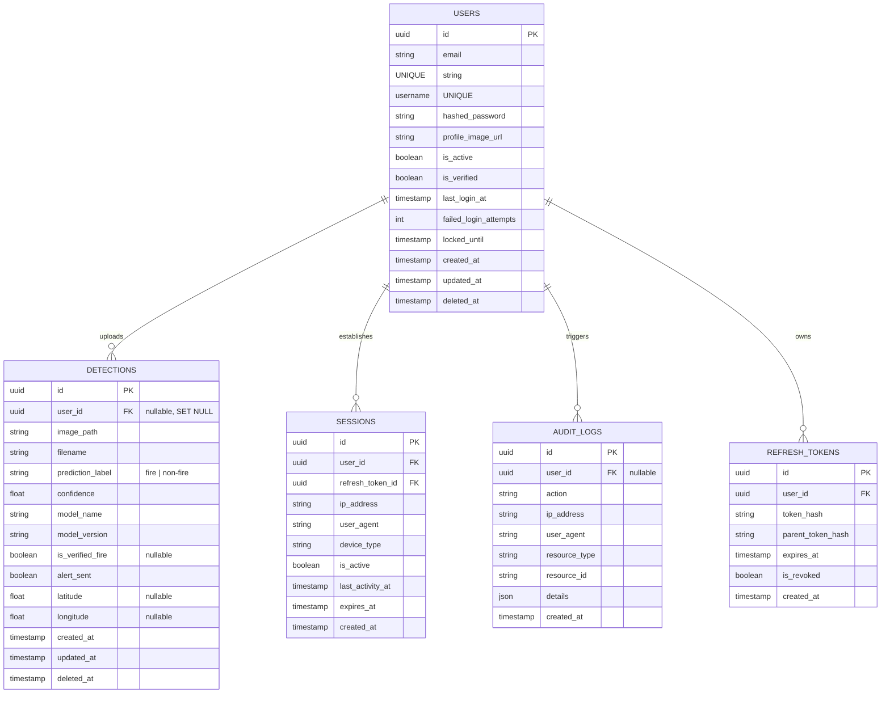
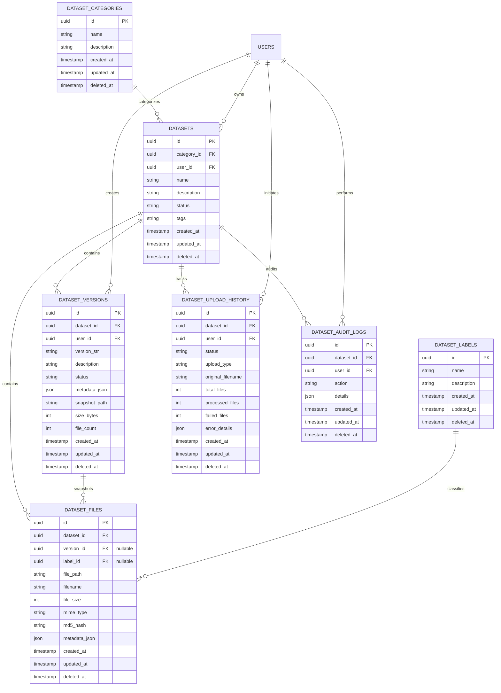
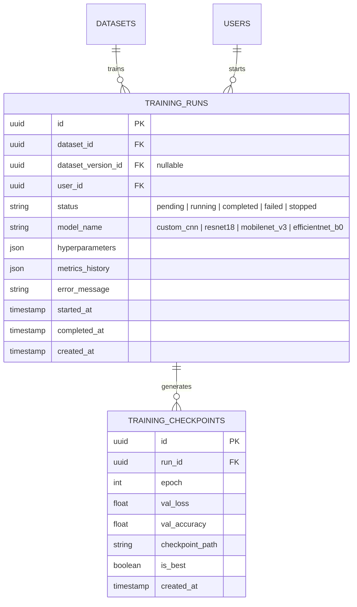
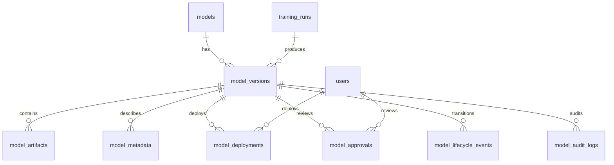

### Step 2: Database Schema & Design Review

The data model utilizes UUID primary keys, automated audit timestamps, and soft delete fields. The schema supports both SQLite (development/testing) and PostgreSQL (production).


---
#### Database Tables Description
1. **`users`**: Stores user credentials, lockout settings, verification statuses, and soft deletes.
2. **`roles` / `permissions`**: RBAC system defining roles (`Super Admin`, `Forest Officer`, `Emergency Response Officer`, `Research Analyst`, `Viewer`) and granular access rights.
3. **`detections`**: Logs image classification requests (CNN inference results, confidence, coordinates, and manual verification check state).
4. **`refresh_tokens` / `sessions`**: Implements session tracking, token rotation (RTR), and device logging.
5. **`audit_logs`**: Registers security actions (`user.login`, `user.register`, etc.) for auditing.

#### Index Optimization
To support fast query aggregations under load, the database relies on indexes for:
- `users(email)` and `users(username)` (fast logins)
- `detections(prediction_label)`, `detections(is_verified_fire)`, `detections(created_at)` (fast metrics)
- `sessions(user_id, is_active)` (rapid session tracking)

---


### Step 8: Dataset Architecture, Directory Layout & Database Design

#### Directory Structure Layout
To support scaling and multi-tenant structures, files are organized in a structured local workspace or cloud prefix pattern:
```
storage/
├── datasets/
│   └── {dataset_id}/
│       ├── raw/                  # Active unversioned file registry
│       │   ├── image_001.jpg
│       │   └── image_002.png
│       └── snapshots/            # Immutable version snapshots
│           ├── v1.0.0.zip
│           └── v1.1.0.zip
└── temp/                         # Temporary staging folders for zip extractions
    └── {upload_id}/
```

#### Database Schema Diagram & ERD


#### Database Table Definitions & Optimizations
- **UUID Primary Keys**: All tables use `uuid.UUID` primary keys mapped via SQLAlchemy's Uuid column, preventing database enumeration attacks.
- **Soft Deletes**: Tables implement a `deleted_at` nullable timestamp column. Standard queries will exclude records where `deleted_at is not None`.
- **Index Performance**:
  - `dataset_files(dataset_id, md5_hash)`: Speeds up deduplication checks when uploading files.
  - `dataset_versions(dataset_id, version_str)`: Ensures unique versions per dataset and accelerates queries for version history.
  - `dataset_files(label_id)`: Used to quickly aggregate category distributions.
  - `dataset_audit_logs(dataset_id, created_at)`: Optimizes fetching audit trails.

---


### Step 21: Training Database Schema & Design

The database schema manages run parameters, historical epoch metrics, and saved checkpoint paths. The tables link back to `datasets` and the initiating `users`.



---


### Step 11: Dataset Versioning, Immutability & Rollback Lifecycle

#### The Immutability Concept
- **Active State (`raw/`)**: Uploads are writeable, allowing adding files, modifying labels, and bulk adjustments.
- **Freeze State (`version`)**: Snapshotting zips the entire set of active files, saves it to storage as `{version_str}.zip`, and saves metadata (file hashes, count, class distribution) to the database.
- **File Locking**: The files are assigned a `version_id` in the database, freezing them. Any future uploads create new files with `version_id=None`.

#### Version Rollback Lifecycle
A rollback operation restores active files in the workspace (`raw/`) to match a target version's frozen snapshot:
1. **Request**: `POST /api/v1/datasets/{id}/rollback` with `{"version_str": "v1.0.0"}` is received.
2. **Clean active**: The backend deletes all current files in the database where `version_id is None` and removes their files from the `raw/` directory in storage.
3. **Unzip and Restore**: The snapshot ZIP for `v1.0.0` is downloaded and extracted. The files are written back to `raw/` in storage, and new database file records are inserted with `version_id=None` (meaning they are now active and modifiable).
4. **Audit**: The rollback is logged in the audit logs.

#### MLOps Training Integration
ML training scripts can dynamically pull specific version snapshots using curl:
```bash
# Retrieve zip snapshot directly for training
curl -H "Authorization: Bearer <TOKEN>" \
     -o dataset_v1.0.0.zip \
     http://localhost:8000/api/v1/datasets/18f9720b-22ab-44b4-a21b-c74191c2bde2/versions/v1.0.0/download
```

---


### Model Database Review


### Model Registry Database Architecture Review

This document reviews the schema design and database relationships for the Forest Fire Detection Model Registry. All tables are designed to satisfy enterprise governance, traceability, audit logs, soft deletes, and optimized queries.

---

#### 1. Entity Relationship Diagram



---

#### 2. Table Specifications

All tables inherit from `BaseModel` and utilize **UUIDv4** primary keys, custom timezone-aware audit timestamps (`created_at`, `updated_at`), and nullable deletion markers (`deleted_at`) to enforce soft deletes repository-wide.

##### 2.1 Table: `models`
Tracks top-level model definitions (e.g. `custom_cnn`, `resnet18`).

| Column | Type | Constraints | Description |
| :--- | :--- | :--- | :--- |
| `id` | UUID | Primary Key, Index | Unique identifier |
| `name` | String(100) | Unique, Index, Not Null | Unique model definition key |
| `description` | String(500) | Nullable | General model objective |
| `created_by` | UUID | FK -> `users.id` | User registered the definition |
| `created_at` | DateTime | Not Null | Creation timestamp |
| `updated_at` | DateTime | Not Null | Update timestamp |
| `deleted_at` | DateTime | Nullable | Soft delete timestamp |

*   **Indexes:** Unique index on `name` for quick checks.

##### 2.2 Table: `model_versions`
Stores semantic versions (`major.minor.patch`) linked to training runs.

| Column | Type | Constraints | Description |
| :--- | :--- | :--- | :--- |
| `id` | UUID | Primary Key, Index | Unique identifier |
| `model_id` | UUID | FK -> `models.id`, Not Null | Parent model definition reference |
| `version` | String(50) | Not Null, Index | Semantic version (e.g., `1.0.0`) |
| `training_run_id` | UUID | FK -> `training_runs.id`, Nullable | Associated training lineage |
| `checkpoint_id` | UUID | FK -> `training_checkpoints.id`, Nullable | Source checkpoint weights |
| `status` | String(50) | Not Null, Index | State: Draft, Validation, Approved, etc. |
| `created_by` | UUID | FK -> `users.id` | User registered this version |
| `description` | String(1000) | Nullable | Release description |
| `release_notes` | Text | Nullable | Change details |
| `metrics` | JSON | Nullable | Snapshot of validation / test metrics |
| `hyperparameters` | JSON | Nullable | Hyperparameter values snapshot |
| `created_at` | DateTime | Not Null | Creation timestamp |
| `updated_at` | DateTime | Not Null | Update timestamp |
| `deleted_at` | DateTime | Nullable | Soft delete timestamp |

*   **Indexes:** Composite index on `(model_id, version)` to accelerate discovery.

##### 2.3 Table: `model_artifacts`
Manages supplementary training files, charts, configurations, and reports.

| Column | Type | Constraints | Description |
| :--- | :--- | :--- | :--- |
| `id` | UUID | Primary Key, Index | Unique identifier |
| `model_version_id` | UUID | FK -> `model_versions.id`, Not Null | Linked model version |
| `name` | String(255) | Not Null | Filename (e.g., `confusion_matrix.png`) |
| `artifact_type` | String(50) | Not Null, Index | Type: weights, config, report, etc. |
| `uri` | String(512) | Not Null | Storage provider URI or path |
| `file_size` | Integer | Nullable | File size in bytes |
| `checksum` | String(64) | Nullable | SHA256 checksum for integrity audits |
| `created_by` | UUID | FK -> `users.id` | Uploader ID |
| `created_at` | DateTime | Not Null | Creation timestamp |
| `updated_at` | DateTime | Not Null | Update timestamp |
| `deleted_at` | DateTime | Nullable | Soft delete timestamp |

##### 2.4 Table: `model_metadata`
Key-value metadata dictionary for flexible, non-relational parameters.

| Column | Type | Constraints | Description |
| :--- | :--- | :--- | :--- |
| `id` | UUID | Primary Key, Index | Unique identifier |
| `model_version_id` | UUID | FK -> `model_versions.id`, Not Null | Linked model version |
| `key` | String(100) | Not Null, Index | Parameter name (e.g. `framework_version`) |
| `value` | Text | Not Null | Parameter value |
| `value_type` | String(50) | Not Null | Type: string, integer, float, json |
| `created_at` | DateTime | Not Null | Creation timestamp |
| `updated_at` | DateTime | Not Null | Update timestamp |
| `deleted_at` | DateTime | Nullable | Soft delete timestamp |

*   **Indexes:** Composite index on `(model_version_id, key)`.

##### 2.5 Table: `model_deployments`
Tracks active models running live in target environments.

| Column | Type | Constraints | Description |
| :--- | :--- | :--- | :--- |
| `id` | UUID | Primary Key, Index | Unique identifier |
| `model_version_id` | UUID | FK -> `model_versions.id`, Not Null | Deployed model version |
| `environment` | String(50) | Not Null, Index | Environment: `staging`, `production` |
| `status` | String(50) | Not Null, Index | Status: active, inactive, rolled_back, failed |
| `deployed_by` | UUID | FK -> `users.id` | User authorizing the deployment |
| `deployed_at` | DateTime | Not Null | Deployment start time |
| `undeployed_at` | DateTime | Nullable | Deployment end time |
| `metrics` | JSON | Nullable | Run-time/canary performance stats |
| `created_at` | DateTime | Not Null | Creation timestamp |
| `updated_at` | DateTime | Not Null | Update timestamp |
| `deleted_at` | DateTime | Nullable | Soft delete timestamp |

##### 2.6 Table: `model_approvals`
Tracks request & review workflow history for stage promotions.

| Column | Type | Constraints | Description |
| :--- | :--- | :--- | :--- |
| `id` | UUID | Primary Key, Index | Unique identifier |
| `model_version_id` | UUID | FK -> `model_versions.id`, Not Null | Model version reviewed |
| `requested_by` | UUID | FK -> `users.id`, Not Null | Requester ID |
| `requested_at` | DateTime | Not Null | Request timestamp |
| `request_notes` | String(500) | Nullable | Purpose of stage promotion |
| `target_stage` | String(50) | Not Null, Index | Target state (Approved, Staging, Production) |
| `status` | String(50) | Not Null, Index | Review status: pending, approved, rejected |
| `reviewed_by` | UUID | FK -> `users.id`, Nullable | Reviewer ID |
| `reviewed_at` | DateTime | Nullable | Review completion timestamp |
| `review_notes` | String(1000) | Nullable | Notes from reviewer |
| `created_at` | DateTime | Not Null | Creation timestamp |
| `updated_at` | DateTime | Not Null | Update timestamp |
| `deleted_at` | DateTime | Nullable | Soft delete timestamp |

##### 2.7 Table: `model_lifecycle_events`
Tracks history of all lifecycle transitions.

| Column | Type | Constraints | Description |
| :--- | :--- | :--- | :--- |
| `id` | UUID | Primary Key, Index | Unique identifier |
| `model_version_id` | UUID | FK -> `model_versions.id`, Not Null | Targeted model version |
| `from_state` | String(50) | Not Null | Previous state |
| `to_state` | String(50) | Not Null | New state |
| `triggered_by` | UUID | FK -> `users.id`, Not Null | Triggering user |
| `notes` | String(500) | Nullable | Context notes |
| `created_at` | DateTime | Not Null | Creation timestamp |
| `updated_at` | DateTime | Not Null | Update timestamp |
| `deleted_at` | DateTime | Nullable | Soft delete timestamp |

##### 2.8 Table: `model_audit_logs`
Low-level ledger mapping administrative actions, clients, and payloads.

| Column | Type | Constraints | Description |
| :--- | :--- | :--- | :--- |
| `id` | UUID | Primary Key, Index | Unique identifier |
| `model_version_id` | UUID | FK -> `model_versions.id`, Nullable | Linked model version if applicable |
| `action` | String(100) | Not Null, Index | Action: `register`, `approve`, `deploy`, etc. |
| `performed_by` | UUID | FK -> `users.id`, Not Null | Authorized operator |
| `details` | JSON | Nullable | Diffs, state snapshots, and change payloads |
| `client_ip` | String(50) | Nullable | IP address of caller |
| `created_at` | DateTime | Not Null | Creation timestamp |
| `updated_at` | DateTime | Not Null | Update timestamp |
| `deleted_at` | DateTime | Nullable | Soft delete timestamp |

---

#### 3. Query Performance & Indexing Strategy

1.  **Semantic Version Resolution:**
    Composite index on `(model_id, version)` ensures sub-millisecond retrieval of specific model version entities.
2.  **Live Model Swapping:**
    Composite index on `(environment, status)` for `model_deployments` resolves active Production/Staging models instantly, mitigating latency overhead in prediction loops.
3.  **Audit Trail Reconstruction:**
    Index on `model_version_id` across `model_lifecycle_events` and `model_audit_logs` ensures rapid execution history tracing during agency compliance audits.
4.  **Soft Deletes Handling:**
    Filtering on `deleted_at.is_(None)` is applied globally. SQLAlchemy queries automatically leverage these indexes.

---


