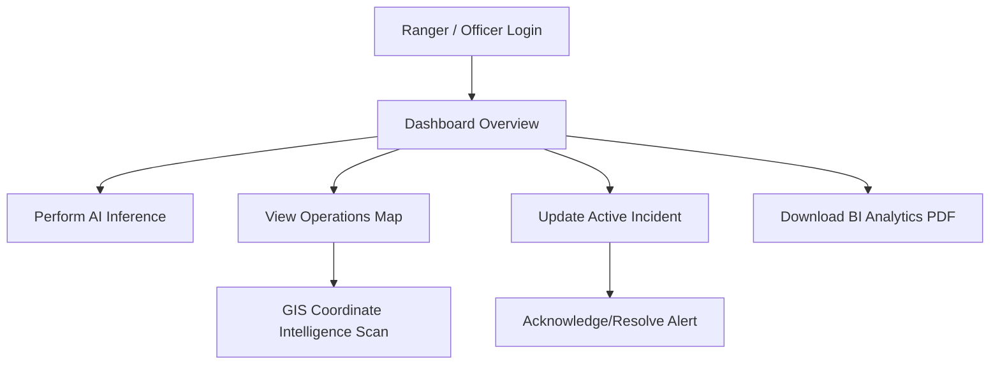

### Phase 1: Frontend Requirements Analysis

#### 1. Backend Capabilities Mapping
- **Identity & Session Governance**: Standard user registration, OAuth2 password logins, JWT credentials rotating, active session revocation, email verification.
- **Surveillance Predictions**: Real-time image uploads for CNN predictions, asynchronous batch file queueing, historic prediction lookups.
- **Incident & Alert Life Cycle**: Alert acknowledgement/resolution workflows, manual alert creation, emergency incident reporting, sitrep sitlogs, response squads coordination.
- **Geospatial Intelligence (GIS)**: Geocoding points, geofencing buffers, administrative regions, coordinate-intelligence containment analysis, live patrol logs.
- **Analytics & BI**: KPI aggregations, time-series metrics trends, saved report templates, ad-hoc report generation (PDF, CSV, JSON).
- **MLOps & Governance**: Model families registry, version increments, stage promotions (Development -> Staging -> Production), promotions reviews, hot-swap deployments, rollbacks.
- **Observability**: PERS logging queries, application correlation metrics, trace spans, SLA compliance tracker.
- **Security Audit**: SIEM threat detection events (SQLi, XSS, Brute force alerts), firewall blocked client IP lists, compliance policies compliance.

#### 2. User Journey Mapping


---


### Phase 2: Product Design & UX Strategy

#### 1. Information Architecture & Site Map
- **Public Routes**:
  - `/auth/login`: Credential validation interface.
  - `/auth/register`: Signup requesting credentials.
- **Private Routes**:
  - `/dashboard`: High-level operations widgets & system telemetry.
  - `/datasets`: File uploads, bulk galleries, dataset version catalogs.
  - `/predictions`: CNN classification upload workspace & prediction history logs.
  - `/gis`: Maps monitoring circular geofences & active fire overlays.
  - `/operations`: Real-time alerts queue, incident sitreps, dispatch rosters.
  - `/analytics`: Time-series trends, ad-hoc PDF download workspace.
  - `/admin`: Security threat alerts, IP block controls, JWT secret rotation, model promote reviews.

#### 2. Desktop and Mobile Layout Strategy
- **Desktop Grid**: Static 64-width left sidebar, sticky top navigation header, scrollable main content viewport.
- **Responsive Mobile Layout**: Floating menu drawer button to toggle sidebar on screens `< 768px`, flex wrap metrics cards, full-bleed data tables.

---


### Phase 3: Design System Architecture

#### 1. Palette Tokens (HSL System)
- **Background Darkest**: `bg-neutral-950` (`#0a0a0a`)
- **Background Dark**: `bg-neutral-900` (`#121212`)
- **Accent Emerald**: `text-emerald-500` (`#10b981`)
- **Emergency Crimson**: `text-rose-500` (`#f43f5e`)
- **Warning Amber**: `text-amber-500` (`#f59e0b`)

#### 2. Glassmorphism Styling Variables
- **Glass Panel**: `rgba(30, 30, 30, 0.65)` backdrop blur `12px` border `rgba(255, 255, 255, 0.08)`.
- **Glass Glowing**: Adds emerald-500 shadow glow `rgba(16, 185, 129, 0.15)`.

---


### Phase 4: Frontend Architecture

The codebase follows the Next.js App Router structure:
```
frontend/src/
├── app/
│   ├── admin/             # Governance controls
│   ├── analytics/         # BI Charts & exports
│   ├── auth/              # Login / Register
│   ├── dashboard/         # Telemetry panels
│   ├── datasets/          # Data uploads & snaps
│   ├── gis/               # Dynamic leaflet maps
│   ├── operations/        # Alerts / Incidents
│   ├── globals.css        # Tailwind overrides
│   └── layout.tsx         # Context providers wrapper
├── components/
│   ├── gis/               # Dynamically loaded maps
│   ├── layout/            # Sidebar, Navbar, Toasts
│   └── ui/                # Buttons, Cards, Inputs
├── lib/
│   └── api-client.ts      # Fetch client with RTR rotate
├── providers/
│   └── query-provider.tsx # React query wrap
├── services/              # Mapped API functions
├── store/                 # Zustand state stores
```

---


### Phase 5: API Integration Specifications

Our [api-client.ts](file:///c:/Users/Akshay/OneDrive/Desktop/New%20folder/Forest-Fire-Detection-using-CNN/frontend/src/lib/api-client.ts) supports:
- **Authorization Injection**: Attaches `Authorization: Bearer <accessToken>` from useAuthStore to each request.
- **Token Rotation Interceptor (RTR)**: Intercepts `401 Unauthorized` responses. If a `refreshToken` exists, triggers `/auth/refresh` in the background, updates credentials in Zustand, and retries the original request block.
- **Direct Backend Proxy**: Maps routes to the backend port `8000` via Next.js next.config.js rewrites to prevent CORS preflight latency.

---


### Phase 6: Client & Server State Management

- **Client State (Zustand)**:
  - `auth-store.ts` -> Logged-in user profiles, tokens, role validation helpers. Persisted to `localStorage`.
  - `ui-store.ts` -> Sidebar toggling states, toast queues.
- **Server State (TanStack Query)**:
  - Cache duration: 5 minutes.
  - Periodic polling: Dashboard telemetry and system metrics auto-refresh every 10 seconds.
  - Automatic Invalidation: Uploading files or resolving alerts automatically refetches lists.

---


### Phase 7-14: Modular UI Guides

#### 1. Authentication Experience
- Features password matches checks, user exists verification. Renders roles list inside session tables.

#### 2. Dashboard Experience
- Combines model accuracy parameters with Recharts line graphs. Renders live system resource usage bars.

#### 3. Datasets & Images Experience
- Supports ZIP dataset upload. Drag-and-drop imagery, showing upload progress indicators.

#### 4. CNN Predictions Experience
- Triggers model evaluation instantly. Includes lat/lng inputs for overlays and rendering of predictions classes.

#### 5. GIS map Experience
- Wraps Leaflet within dynamic imports. Plots Circular geofences and active warning buffer shapes.

#### 6. Operations Control Center
- Consolidates active alerts and incident logs. Includes dispatch squad selector and update message inputs.

#### 7. BI & Reports
- Allows ad-hoc format compilation selection (PDF, CSV, JSON) and initiates file stream downloads.

#### 8. Governance & Administration
- Displays SIEM threat counters and blocked firewall IP grids. Allows JWT secret key rotation.

---


### Phase 15: Accessibility Audit (WCAG 2.1 AA)

- **Keyboard Focus Routing**: Focus rings are visible on all interactive buttons, selection lists, and form inputs.
- **Semantic Tags**: Utilizes HTML5 tags (`<aside>`, `<header>`, `<main>`, `<nav>`, `<input>`) with explicit `aria-label` definitions.
- **Color Contrast**: Complies with standard WCAG 2.1 AA contrast ratio requirements on deep obsidian backgrounds.

---


### Phase 16: Performance Audit & Optimizations

- **Dynamic SSR Bypass**: Dynamically imports the Leaflet map component with `ssr: false` to ensure server rendering build steps complete without `window` errors.
- **Route Splitting**: Next.js automatically chunks route pathways under layout groups.
- **Prefetch Controls**: Preloads dashboard layouts on login success to optimize routing latency.

---


### Phase 17: Testing Strategy & Scenarios

#### Unit Testing Mocks (Jest & React Testing Library)
- **Auth Flow Mock**: Mocking login resolver to assert store updates.
- **Service Layer Mock**: Intercept fetch endpoints to assert form serialization values.
- **Component Integrity**: Assert that Glassmorphism cards and toast alerts mount and trigger callback functions.

---


