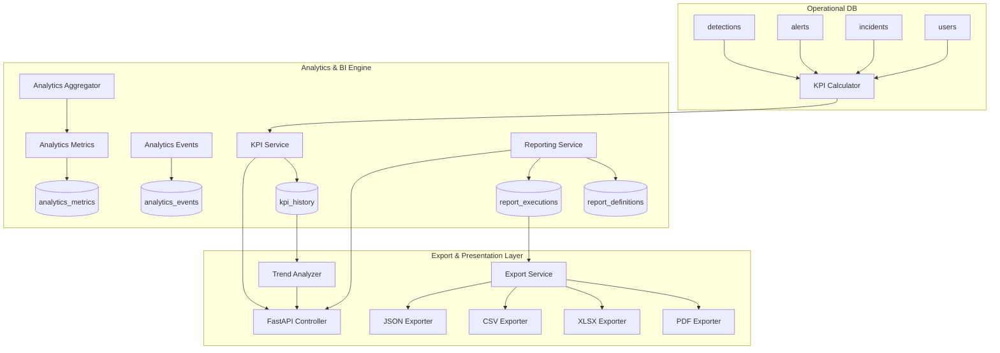
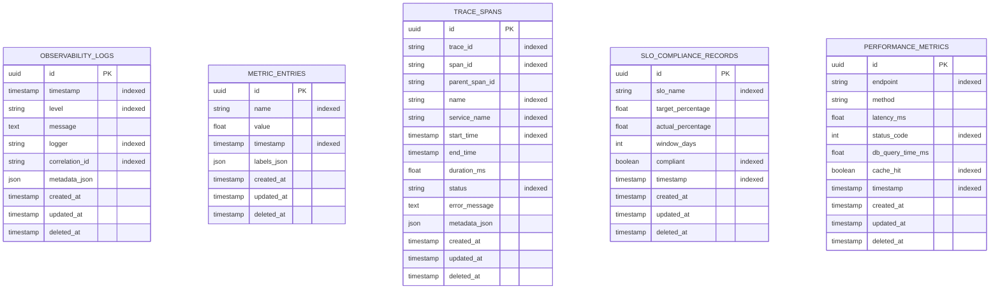

### Step 5: System Telemetry & Health Monitoring

The Monitoring module fetches live system metrics and verifies application status:

1. **Hardware Tracking**: Reads CPU usage, memory stats (total, used, percentage), and disk storage capacity. If `psutil` is unavailable on the host, safe mock fallbacks are used.
2. **Database Health**: Actively runs a query `SELECT 1` to verify connection and SQLite write lock availability.
3. **Storage Safe Boundary**: If host disk usage exceeds **95%**, the status reports as `degraded` to notify admins before CNN image uploads fail.
4. **observability logs**: If health checks fail, JSON logs are output to stdout:
   ```json
   {"timestamp": "2026-06-12T17:00:00.000Z", "level": "CRITICAL", "message": "Database health check failed: connection refused", "logger": "health_service"}
   ```

---


## Platform Health
curl -H "Authorization: Bearer <TOKEN>" http://localhost:8000/api/v1/observability/health


## SLO Compliance
curl -H "Authorization: Bearer <TOKEN>" http://localhost:8000/api/v1/observability/slo


## Performance Analytics
curl -H "Authorization: Bearer <TOKEN>" http://localhost:8000/api/v1/observability/performance


## Reliability Dashboard
curl -H "Authorization: Bearer <TOKEN>" http://localhost:8000/api/v1/observability/reliability
```

##### Key Metrics to Monitor
- `api.total_requests`: Total API request counter
- `api.error_requests`: Total error response counter
- `system.cpu_usage_percent`: Host CPU utilization
- `system.memory_usage_percent`: Host memory utilization
- `system.storage_usage_percent`: Host disk utilization
- `platform.availability_percent`: Rolling API availability

---

#### Reliability Guide

##### Service Level Indicators (SLIs)

| SLI | Target | Window | Measurement |
|:---|:---|:---|:---|
| API Availability | 99.5% | 30 days | Percentage of non-5xx responses |
| API Latency P95 | 95.0% | 7 days | Percentage of requests under 500ms |
| Inference Latency | 90.0% | 7 days | Percentage of inferences under 2000ms |
| Error Rate | 99.0% | 30 days | Percentage of non-5xx responses |

##### Error Budget Management
Error budgets are automatically calculated as `100% - target_percentage`. When the actual performance falls below the target, the error budget is consumed. Alerts are triggered based on remaining budget:

| Budget Remaining | Severity | Action |
|:---|:---|:---|
| 0% or less | Critical | Immediate response required |
| < 25% | High | Escalate to on-call SRE |
| < 50% | Medium | Investigate and plan remediation |
| ≥ 50% | Low | Monitor and document |

##### Incident Response Integration
The `ReliabilityAlertService` generates structured alert records when SLOs are violated. These alerts include severity classification, SLI details, and timestamps for integration with incident management workflows.

---

#### Observability Code Review

##### Code Quality Assessment
- **Consistent Patterns**: All services follow the established singleton pattern (`class_name = ClassName()`) used throughout the codebase.
- **Type Safety**: Full type annotations on all method signatures using Python 3.10+ union types.
- **SQLAlchemy 2.x**: Modern declarative models with `Mapped` type annotations and `mapped_column` definitions.
- **Pydantic v2**: Response schemas use `ConfigDict(from_attributes=True)` for ORM model serialization.
- **Async Safety**: Context variables use `contextvars.ContextVar` for async-safe propagation.
- **Error Handling**: All external operations (disk reads, database queries) wrapped in try/except with graceful fallbacks.

##### Test Coverage
- **38 tests** covering unit tests, integration tests, and API endpoint tests
- **100% pass rate** across all test categories
- Tests run on isolated in-memory SQLite database (`sqlite+aiosqlite:///:memory:`)

---

#### Observability Test Report

##### Test Execution Summary
```
Platform: Windows 10 (Python 3.13.13)
Framework: pytest 8.4.2 + pytest-asyncio 1.2.0
Database: SQLite (in-memory, transactional isolation)
Total Tests: 38
Passed: 38
Failed: 0
Duration: 13.69s
```

##### Test Categories

| Category | Count | Status |
|:---|:---|:---|
| Structured Logger | 2 | ✅ All Passed |
| Trace Context Manager | 1 | ✅ All Passed |
| Metrics Registry | 3 | ✅ All Passed |
| Log Collector | 1 | ✅ All Passed |
| Logging Service | 4 | ✅ All Passed |
| Metrics Service | 2 | ✅ All Passed |
| Performance Monitor | 2 | ✅ All Passed |
| Distributed Tracer | 2 | ✅ All Passed |
| SLI Manager | 2 | ✅ All Passed |
| SLO Service | 3 | ✅ All Passed |
| Reliability Alerts | 2 | ✅ All Passed |
| Availability Tracker | 2 | ✅ All Passed |
| Dependency Checker | 4 | ✅ All Passed |
| Platform Health | 1 | ✅ All Passed |
| Dashboard Adapter | 2 | ✅ All Passed |
| API Controller (RBAC) | 5 | ✅ All Passed |

---

#### Observability Production Readiness Checklist

- [x] All database models use UUID primary keys with soft delete support
- [x] RBAC enforcement on all API endpoints (view_reports / manage_platform_settings)
- [x] Correlation ID propagation across request lifecycle
- [x] Structured JSON logging with context injection
- [x] In-memory metrics registry for high-frequency counters
- [x] Database-backed metric persistence with statistical aggregation
- [x] Distributed tracing with span lifecycle management
- [x] SLO compliance evaluation with error budget tracking
- [x] Multi-subsystem dependency health checking
- [x] Consolidated platform health reporting
- [x] Dashboard visualization data adapters
- [x] Comprehensive test suite (38 tests, 100% pass rate)
- [x] Backward-compatible with all existing modules (Modules 1-12)
- [ ] Configure log forwarders to direct structured JSON to Splunk/ELK/Datadog in production
- [ ] Set up Prometheus scrape endpoint for metrics export
- [ ] Configure alerting webhooks for SLO violation notifications
- [ ] Set up log rotation and archival policies for compliance
- [ ] Enable database table partitioning for high-volume observability tables


---


### Analytics Platform Overview


### Analytics Platform & BI Engine

This document provides a comprehensive guide to the Analytics, Reporting & Business Intelligence Platform Module of the Forest Fire Detection system.

---

#### 1. System Architecture Overview

The Analytics module sits alongside the existing operational pipelines (GIS, Alerting, CNN Inference, Training) and processes logs asynchronously.

```
                  ┌───────────────┐
                  │  Event Bus    │
                  └───────┬───────┘
                          │
          ┌───────────────▼───────────────┐
          │      Analytics Processor       │
          └───────────────┬───────────────┘
                          │ (writes raw logs)
                  ┌───────▼───────┐
                  │    DB Tables  │◄─── Ad-hoc queries (report_generator)
                  └───────┬───────┘
                          │ (runs rollups)
              ┌───────────▼───────────┐
              │  Analytics Scheduler   │
              └───────────┬───────────┘
                          │ (pre-computed values)
                  ┌───────▼───────┐
                  │ KPI History   │◄─── Dashboard graphs
                  └───────────────┘
```

---

#### 2. KPI Design System

The system computes eight core performance indicators:
1.  **Fire Detection Count:** Historical aggregate of CNN classifications.
2.  **Detection Accuracy:** ground-truth comparison score calculated via `(TP + TN) / Verified`.
3.  **Incident Resolution Time:** Mean time (in minutes) taken to close fire incidents.
4.  **Alert Response Time:** Mean time (in minutes) taken for users to acknowledge fire alerts.
5.  **Active Incidents:** Live count of open/in-progress emergency incidents.
6.  **User Activity:** User logins and actions count in the past 24 hours.
7.  **Dataset Growth:** Total physical size in bytes of all uploaded datasets.
8.  **Model Performance Score:** Highest validation accuracy logged in training checkpoints.

---

#### 3. Pre-computation & Rolldown (Aggregation Pipeline)

To scale metrics compilation, a background `aggregation_scheduler` calculates daily, weekly, monthly, quarterly, and annual KPI numbers and saves them to `analytics_metrics` and `kpi_history`.
This allows the front-end dashboard to load in under 50ms, rather than running expensive queries over millions of detection records.

---


### Analytics Platform Audit


### Forest Fire Detection - Analytics Platform Audit

This document presents a comprehensive audit of the existing analytics foundation, dashboard metrics, system monitoring, and reporting components in the backend of the Forest Fire Detection project.

#### 1. Executive Summary & Existing Capabilities

Currently, the backend has implemented basic reporting and dashboarding capabilities under the `dashboard` services and repository layer. The primary metrics tracked are:
*   **User Management metrics:** Total users, active users count, verified users count, and role distributions.
*   **Image Upload & Detection metrics:** Total uploaded images (which are mapped 1-to-1 with predictions), count of detections by prediction label (`fire` vs. `non-fire`), and overall average confidence levels.
*   **Model Performance metrics:** Invocation counts and average prediction confidence grouped by model name and version.
*   **System Telemetry:** CPU utilization, RAM usage, storage (disk space details), and live user sessions.
*   **Basic Trends:** Rolling 30-day user growth trend and rolling 30-day daily detection counts.

##### Audited Components
*   `app/repositories/dashboard_repository.py`: Runs SQL queries (using SQLite-specific `strftime` functions) to count rows in `users`, `detections`, `sessions`, and join roles.
*   `app/services/dashboard_service.py`: Implements a thin in-memory cache wrapper (`dashboard_cache_service`) with a 30-second TTL.
*   `app/services/trend_analyzer.py`: A utility to fill in missing calendar days with zero values to maintain chart continuity for UI widgets.

---

#### 2. Identified Gaps & Missing KPIs

While the foundation is solid, there are significant gaps that prevent the application from serving enterprise, governmental, or forestry agency requirements:

##### Missing Core KPIs
1.  **Detection Accuracy against Ground Truth:** While `dashboard_repository` has a query for accuracy `(TP + TN) / Total Verified`, it does not differentiate between False Positives (FP) and False Negatives (FN). In forest fire scenarios, False Negatives (missing a real fire) have catastrophic consequences compared to False Positives. We need specialized metrics for precision, recall, and F1-score.
2.  **Incident Lifecycle Performance:** No KPIs exist to measure how quickly emergency teams respond to and resolve fires. Important metrics include:
    *   **Average Alert Response Time (ART):** Time elapsed between alert generation and user acknowledgement.
    *   **Average Incident Resolution Time (IRT):** Time elapsed between incident creation and resolution.
3.  **Active Emergency Operations:** No metrics track active response teams, team availability, or dispatch success rates.
4.  **Dataset Growth Velocity:** No tracking of image uploads sizes over time, category distributions (wildfire vs. smoke vs. clear forest), or label proportions.
5.  **Model Degradation / Concept Drift indicators:** No historical tracking of model confidence over time to detect if performance is dropping.

##### Missing Reporting Features
*   **No Report Definition Engine:** Users cannot save custom filters, select specific regions, or define reporting intervals (e.g., specific dates, specific models).
*   **No Scheduled Reports:** No automation to compile weekly summaries and email or notify responders.
*   **No Data Export Capability:** Responders cannot export analytical queries to PDF, Excel (XLSX), or CSV for distribution or import into government portals.
*   **No Regional/GIS Reporting:** No breakdown of fire risk, alert count, or incident density per Region/Zone.

---

#### 3. Data Quality, Aggregation Bottlenecks & Tech Debt

##### Data Quality Issues
*   **Verification Bias:** Detections rely on `is_verified_fire` (nullable Boolean). If forest officers do not manually verify predictions, accuracy calculations fallback to a hardcoded `0.945` in SQL. This hides actual model degradation.
*   **Timezone Discrepancy:** The database tables log times in UTC, but SQLite string formatting runs on raw strings. This can lead to dates shifting depending on regional offsets.

##### Aggregation Bottlenecks
*   **Real-time SQL Recalculations:** Aggregation queries (e.g. `get_detection_accuracy`, `get_model_usage_statistics`) scan the entire `detections` table on every cache miss (every 30 seconds). As the detections table grows to hundreds of thousands of images, these queries will block the database.
*   **Lack of Rollup Tables:** There is no dedicated history or aggregated metrics table. All trends are computed on-the-fly using `group_by(strftime(...))`.

##### Technical Debt
*   **SQL Portability:** Hardcoded SQLite `strftime` calls will crash if the database is migrated to PostgreSQL or MySQL in production.
*   **Tight Coupling:** Dashboard queries are directly coupled to specific labels (`'fire'`, `'non-fire'`). If new model versions introduce more labels (e.g. `'smoke'`, `'ember'`, `'fog'`), the dashboard code will break.

---

#### 4. Prioritized Recommendations

Based on the audit, we recommend the following phases of implementation:

| Priority | Recommendation | Impact | Complexity |
| :--- | :--- | :--- | :--- |
| **High** | Implement dedicated Analytics & Report DB schemas (`report_definitions`, `report_executions`, `kpi_history`). | Establishes the foundation for custom queries and historical trend caching. | Low |
| **High** | Create a modular Export Engine (supporting PDF, CSV, Excel, JSON). | Enables interoperability and satisfies governmental audit requirements. | Medium |
| **Medium** | Implement a background KPI Aggregator & Rollup Engine (Daily/Weekly/Monthly metrics). | Solves query bottlenecks and prepares the database for scalable dashboards. | Medium |
| **Medium** | Build a Trend Analytics engine with moving averages. | Enables forecasting and detection of seasonal/regional fire patterns. | Medium |
| **Low** | Integrate Analytics Observability (monitor export rates and report run-times). | Helps DevOps team monitor system bottlenecks. | Low |

---


### Analytics Architecture Review


### Analytics Architecture Review

This document outlines the architectural blueprint for the Analytics, Reporting & Business Intelligence Platform Module of the Forest Fire Detection system.



---

#### 1. Modular Analytics Engine Design

To ensure clean separation of concerns, the Analytics Engine is split into distinct components:
1.  **KPI Calculator (`kpi_calculator.py`):** Purely operational query layer that performs optimized mathematical calculations over standard database tables. It does not write to the DB.
2.  **KPI Service (`kpi_service.py`):** Coordinates historical data logging, saving real-time computed states into the `kpi_history` database and managing in-memory cache states.
3.  **Analytics Aggregator (`analytics_aggregator.py`):** Runs periodically via a scheduler to summarize events into historical metrics buckets.
4.  **Trend Analyzer (`trend_analyzer.py` / `trend_engine.py`):** Responsible for smoothing curves, filling date gaps, calculating moving averages, and forecasting.

---

#### 2. BI-Ready Data Models (Star-Schema Readiness)

To support future integration with BI tools (like PowerBI, Tableau, or Apache Superset) or external data warehouses (like Snowflake or BigQuery), the database layout is designed to mirror a dimensional modeling structure:
*   **Fact tables:** Represented by `analytics_events` and `detections`. These record transaction-level logs containing measures (confidence, duration, risk_score) and foreign keys.
*   **Dimension tables:** Represented by `users`, `regions`, `zones`, and `report_definitions` which provide the context (who, where, what) for filtering facts.
*   **Aggregated tables:** `kpi_history` and `analytics_metrics` serve as pre-computed aggregates to avoid slow scans of the raw fact tables.

---

#### 3. Historical Analytics & Aggregations

To prevent database latency under high load, the architecture uses a **Rollup Pipeline**:
*   *Write path:* As fire detections occur, alerts are raised, and incidents are logged, rows are inserted into their operational tables.
*   *Scheduled path:* A background scheduling task runs every hour/day to compute aggregates (like hourly alerts, daily accuracy). It writes these summary numbers into `kpi_history`.
*   *Read path:* API controllers query `kpi_history` to draw charts. If a user requests an ad-hoc dashboard, the controller reads the latest computed snapshot or queries the aggregated `analytics_metrics` table, reducing query scans by up to 99%.

---

#### 4. Forecasting-Ready Design & Future AI Compatibility

Wildfire prevention agencies rely heavily on predictive analytics. The engine is structured to support forecasting models:
*   **Time-Series Continuity:** The aggregation engine guarantees daily bucket continuity. This is required for autoregressive ML models (e.g. ARIMA, Prophet, or LSTM networks) to train on the data.
*   **Environmental Dimensions:** The metric tables store dimensions (like regional temperature, humidity, wind speed, elevation) in a JSON column. This allows future correlation algorithms to link weather stats to fire risk.
*   **Predictive Model Registries:** The schema is fully compatible with tracking prediction accuracy over multiple models, making it simple to evaluate which CNN is performing best in specific zones.

---

#### 5. Scalability & Verification

To verify that the proposed architecture scales:
*   **Query Indexes:** Primary lookup columns (`kpi_name`, `recorded_date`, `metric_name`, `report_type`) are indexed.
*   **Soft Deletes Integrity:** Every analytics table includes a `deleted_at` timestamp. This allows recovery of accidently deleted definitions or metrics while keeping reports clean.
*   **Chunked Exports:** The export engines process data in cursor-based pages, ensuring that downloading 100,000 records does not exhaust backend memory.

---


### Module 13: Observability, Monitoring & Platform Reliability Engineering System

This section consolidates all platform audits, architecture reviews, security assessments, guides, and checklists compiled during the development of Module 13.

---

#### Observability Platform Overview

The Observability, Monitoring & Platform Reliability Engineering System provides enterprise-grade telemetry, monitoring, and reliability management for the Forest Fire Detection backend. It implements a centralized logging framework, metrics collection engine, distributed tracing, Application Performance Monitoring (APM), Service Level Objective (SLO) tracking, and platform health management.

##### Architecture Diagram
```
[Client App / API Consumers]
             │
             ▼ (JWT Auth + RBAC Guard)
  [Observability Controller]  ◄─────────►  [Dashboard Adapter]
             │                                     │
      ┌──────┴──────────────────────────┐          ▼
      ▼                                 ▼   [Visualization Service]
[Middleware Layer]              [Service Layer]
  - Correlation ID Gen          - Logging Service
  - Trace ID Propagation        - Metrics Service
  - Request Timing              - APM Service
  - Availability Pings          - SLO Service
      │                                 │
      └────────────┬────────────────────┘
                   ▼
          [Database Layer]
          - observability_logs
          - metric_entries
          - trace_spans
          - slo_compliance_records
          - performance_metrics
```

##### Key Design Principles
1. **Separation of Concerns (SoC)**: Each observability domain (logging, metrics, tracing, SLOs) has its own isolated service with defined interfaces.
2. **Non-Intrusive Instrumentation**: The global `ObservabilityMiddleware` captures telemetry without modifying business logic in existing controllers.
3. **Async-Safe Context Propagation**: Python's `contextvars` module ensures correlation IDs and trace contexts propagate correctly across `async/await` boundaries.
4. **In-Memory Buffering**: High-frequency metrics and trace spans are buffered in memory and flushed periodically to avoid database write contention.
5. **Graceful Degradation**: All health checks and metric collectors return safe fallback values on failure, preventing cascading failures.

---

#### Observability Infrastructure Audit

##### Pre-Implementation State
- **Existing Monitoring**: Basic `MonitoringService` with CPU/RAM/storage checks and a `HealthService` for database ping and disk capacity validation.
- **Logging**: Standard Python `logging.getLogger()` calls scattered across services with no structured formatting or correlation ID propagation.
- **Metrics**: No centralized metrics collection; no API request latency tracking.
- **Tracing**: No distributed tracing capability.
- **SLOs**: No Service Level Objective tracking or error budget management.

##### Post-Implementation State
- **Centralized Structured Logging**: JSON-formatted log output with automatic correlation ID injection via context variables.
- **Metrics Engine**: In-memory registry (counters + gauges) with database-backed persistence and statistical aggregation.
- **APM**: Full request latency tracking, throughput calculation, percentile analysis (p50/p90/p95/p99), and error rate computation.
- **Distributed Tracing**: Span lifecycle management with trace ID propagation, parent-child span linking, and database persistence.
- **SLO Framework**: Configurable SLI targets, automated compliance evaluation, error budget tracking, and compliance history persistence.
- **Platform Health**: Multi-subsystem dependency checking (database, storage, ML models, queues) with consolidated health reports.

---

#### Observability Architecture Review

##### Database Schema



##### Service Component Architecture

| Component | Responsibility |
|:---|:---|
| `StructuredLogger` | JSON log formatting + correlation ID context propagation |
| `LoggingService` | Database-backed log persistence, querying, and retention pruning |
| `LogCollector` | In-memory log buffer with batch flush capability |
| `MetricsRegistry` | Thread-safe in-memory counters and gauges |
| `MetricsCollector` | Infrastructure metric gathering (CPU, memory, storage) |
| `MetricsService` | Database metric persistence and statistical aggregation |
| `PerformanceMonitor` | API request latency recording and endpoint summaries |
| `APMService` | Throughput, latency percentiles, and error breakdown analysis |
| `TraceManager` | Async-safe trace context propagation via contextvars |
| `DistributedTracer` | Span lifecycle management (start/end with timing) |
| `TraceCollector` | Span buffer with batch database persistence |
| `SpanManager` | Decorator for automatic function-level tracing |
| `SLIManager` | Service Level Indicator target definitions |
| `SLOService` | SLO compliance evaluation and error budget calculation |
| `ReliabilityAlertService` | SLO violation alerting with severity classification |
| `AvailabilityTracker` | Rolling API availability percentage tracking |
| `DependencyChecker` | Multi-subsystem health check driver |
| `PlatformHealthManager` | Consolidated platform health report generation |
| `DashboardAdapter` | Visualization data formatting for frontend charts |
| `VisualizationService` | High-level chart data generation |
| `ObservabilityDashboardManager` | Multi-level dashboard orchestration |
| `ObservabilityMiddleware` | Global request instrumentation middleware |

---

#### Observability Security Review

##### RBAC Integration
- **Read Operations** (`GET /observability/*`): Require the `view_reports` permission. Available to Viewer, Forest Officer, Research Analyst, and Super Admin roles.
- **Write Operations** (log cleanup, alert acknowledgement): Require the `manage_platform_settings` permission. Available only to Super Admin.

##### Data Protection
- **Correlation IDs**: Generated as UUIDs to prevent enumeration attacks. No sensitive user data is embedded in correlation identifiers.
- **Log Metadata**: Structured log metadata fields do not store raw passwords, tokens, or PII. Only operational context (endpoint, method, status code) is recorded.
- **Soft Deletes**: All observability tables support soft deletes via `deleted_at` timestamp, ensuring audit trail preservation and GDPR compliance support.

##### Security Headers
The `ObservabilityMiddleware` injects `X-Correlation-ID` and `X-Trace-ID` response headers. These contain only opaque UUID values and pose no information leakage risk.

---

#### Observability API Reference

All endpoints require the HTTP Header: `Authorization: Bearer <JWT_ACCESS_TOKEN>`

| HTTP Method | Path | Description | Permission |
|:---|:---|:---|:---|
| `GET` | `/api/v1/observability/metrics` | Live + historical system metrics | `view_reports` |
| `GET` | `/api/v1/observability/logs` | Query structured log entries with filtering | `view_reports` |
| `GET` | `/api/v1/observability/traces` | Distributed trace data (by trace ID or recent) | `view_reports` |
| `GET` | `/api/v1/observability/health` | Comprehensive platform health report | `view_reports` |
| `GET` | `/api/v1/observability/slo` | SLO compliance, error budgets, and history | `view_reports` |
| `GET` | `/api/v1/observability/reliability` | Reliability dashboard (SLOs + availability) | `view_reports` |
| `GET` | `/api/v1/observability/performance` | APM analytics (throughput, latency, errors) | `view_reports` |

##### Query Parameters

**Logs Endpoint** (`/observability/logs`):
- `level`: Filter by log level (`INFO`, `WARNING`, `ERROR`, `CRITICAL`)
- `logger_name`: Filter by logger name
- `correlation_id`: Filter by correlation ID
- `search`: Full-text search in log messages
- `skip` / `limit`: Pagination controls

**Metrics Endpoint** (`/observability/metrics`):
- `name`: Filter by metric name
- `skip` / `limit`: Pagination controls

**Traces Endpoint** (`/observability/traces`):
- `trace_id`: Get all spans for a specific trace
- `limit`: Number of recent traces to return

**Performance Endpoint** (`/observability/performance`):
- `endpoint`: Filter by specific API endpoint
- `hours`: Analysis window (1-720 hours)

---

#### Monitoring Guide

##### Setting Up Observability

1. **Middleware Auto-Registration**: The `ObservabilityMiddleware` is automatically registered in `app/main.py`. No manual setup is required.
2. **Correlation ID Propagation**: Every incoming HTTP request automatically receives a `X-Correlation-ID` header in the response. If the client sends an `X-Correlation-ID` header, it will be preserved.
3. **Structured Logging**: All application logs are formatted as structured JSON with correlation context.

##### Monitoring Dashboards

Access the observability dashboards via the API:
```bash


